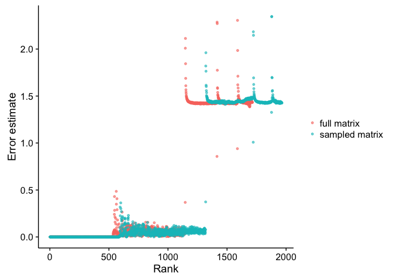
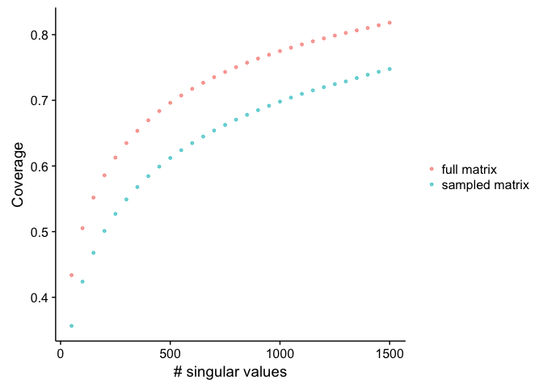

Analysis of the singular values
================
Santina Lin
December 17, 2016

Data
----

The tf matrix was sampled at 0.1 rate and was SVD with nsv=2000.

We'll look at the log file of the GraphLab output from running collaborative filtering on this matrix.

``` r
svals_sampled <- read.table("svals_tf_sampled_0.1_nsv2000.txt", header=TRUE)
svals_full <- read.table("svals_tf_nsv2000.txt", header=TRUE)
head(svals_sampled)
```

    ##   rank singular_value error_estimate
    ## 1    1        907.160    1.09374e-03
    ## 2    2        637.839    3.34235e-12
    ## 3    3        552.660    3.67232e-12
    ## 4    4        492.490    3.46686e-12
    ## 5    5        446.646    3.32340e-12
    ## 6    6        416.233    3.25315e-12

Combine the two data set together

``` r
svals_full$matrix <- factor("full matrix")
svals_sampled$matrix <- factor("sampled matrix")
all <- rbind(svals_full, svals_sampled)
```

### Error estimates

First let's plot the error

``` r
ggplot(all, aes(x = rank, y = error_estimate, color=matrix)) + geom_point(size=1, alpha=0.6) + ylab("Error estimate") + xlab("Rank") + theme(legend.title=element_blank())
```



``` r
nsv <- sum(svals_sampled$error_estimate < 0.5)
nsv
```

    ## [1] 1319

``` r
svals_sampled$error_estimate[nsv]
```

    ## [1] 0.373016

``` r
svals_sampled$error_estimate[nsv+1]
```

    ## [1] 1.81948

### Singular values

Plotting the singular value

``` r
ggplot(all, aes(x = rank, y = singular_value, color=matrix)) + geom_point(size=1, alpha=0.6) + ylab("Singular value") + xlab("Rank") + theme(legend.title=element_blank())
```


As expected in this sanity check, it's a downward curve that drops in tangential slope sharply after the first few singular value.

### Coverage

``` r
coverage_sampled <- read.table("tf_nsv_2000_0.1_coverage.txt", header=TRUE)
coverage_full <- read.table("tf_nsv_2000_coverage.txt", header=TRUE)
coverage_sampled$matrix <- factor("sampled matrix")
coverage_full$matrix <- factor("full matrix")
all <- rbind(coverage_full, coverage_sampled)
ggplot(all, aes(x = nsv, y = coverage, color=matrix)) + geom_point(size=1, alpha=0.6) + ylab("Singular value") + xlab("nsv") + theme(legend.title=element_blank())
```



### Conclusion

From the error estimation, we'll be using about 1319 nsv to run GraphLab on our original big matrix.

And the result is shown as the overlap graph.
