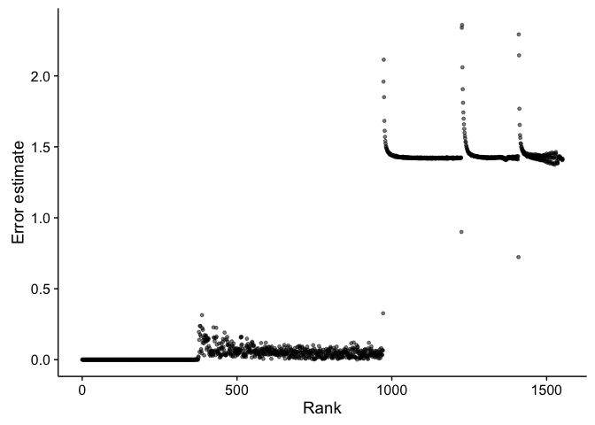
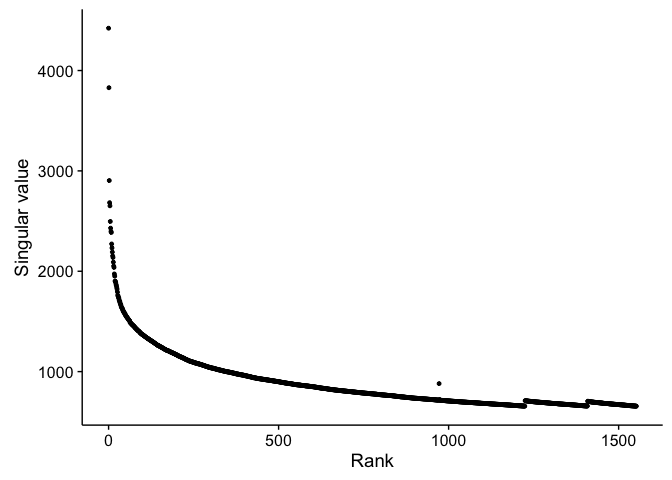
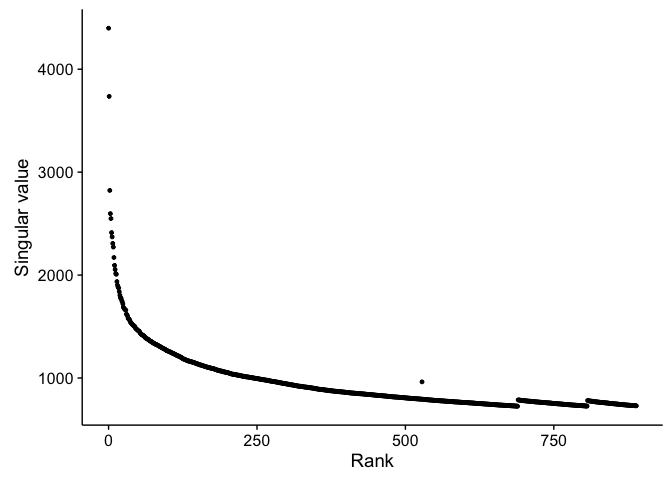
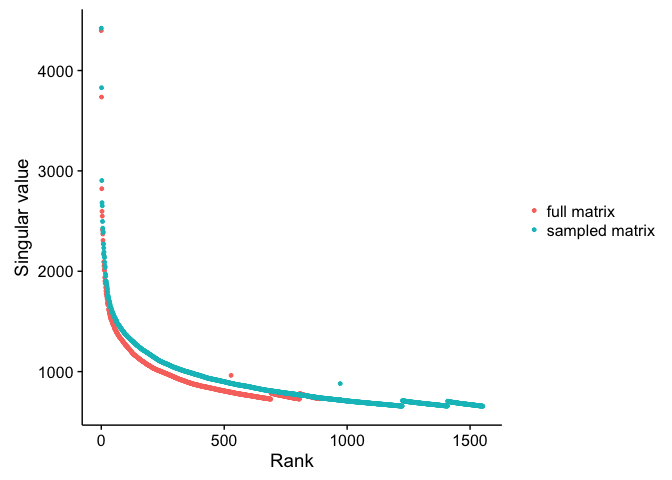
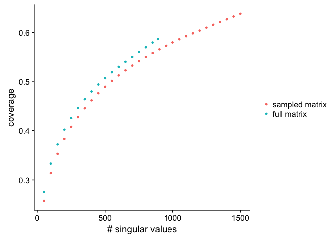
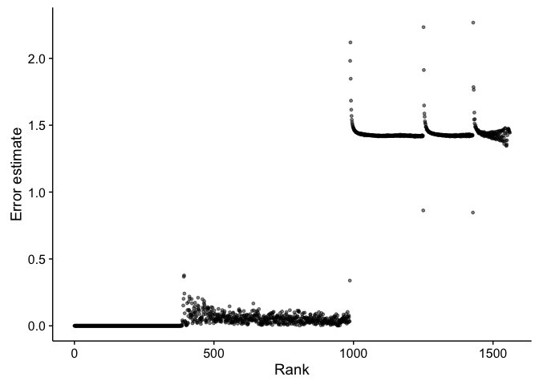

# Big Matrix Sampling 
Santina Lin  
November 26, 2016  

## Overview

This is for examinig the data to prepare for SVD on the big 13-million-abstract matrix. To estimate the number of singular values needed, the following steps were done

- convert the tf to tf-idf 
- scale the tf-idf matrix by 100 
- sample it with a 0.01 sampling rate 
- run SVD on it, specifying nsv = 2000 


```r
library(ggplot2)
library(cowplot)
library(plyr) # note to self: load this before dplyr always. 
library(dplyr)
```

## Data 

We'll look at the log file of the GraphLab output from running collaborative filtering on this matrix. 

```r
singular_value <- read.table("sVals_sampled_matrix_2000_100X0.01.summary", header=TRUE)
head(singular_value)
```

```
##   rank singular_value error_estimate
## 1    0        4421.76    2.26297e-04
## 2    1        3828.88    3.51130e-12
## 3    2        2903.89    3.53349e-12
## 4    3        2683.11    3.51741e-12
## 5    4        2652.21    3.66563e-12
## 6    5        2496.15    3.43492e-12
```

### Error estimates 

First let's plot the error 

```r
ggplot(singular_value, aes(x = rank, y = error_estimate)) + geom_point(size=1, alpha=0.5) + ylab("Error estimate") + xlab("Rank")
```

<!-- -->
It's clear that after some nsv, the error jumps up significantly, so we do not want to use those singular values. Let's find the number of singular values that have less than 0.5 error rate 


```r
nsv <- sum(singular_value$error_estimate < 0.5)
nsv
```

```
## [1] 973
```

### Singular values 

Plotting the singular value

```r
ggplot(singular_value, aes(x = rank, y = singular_value)) + geom_point(size=1) + ylab("Singular value") + xlab("Rank") 
```

<!-- -->

As expected in this sanity check, it's a downward curve that drops in tangential slope sharply after the first few singular value. 

### Conclusion

From the error estimation, we'll be using about 973 nsv to run GraphLab on our original big matrix.  


## On the full matrix 

We used GraphLab to estimate 1100 singular values on the full tfidf matrix. 

### Error estimate 

First let's plot the error 

```r
singularval_fullmatrix <- read.table("sVals_full_matrix_1100.summary", header=TRUE)
ggplot(singularval_fullmatrix, aes(x = rank, y = error_estimate)) + geom_point(size=1, alpha=0.5) + ylab("Error estimate") + xlab("Rank")
```

<!-- -->
It's clear that after some nsv, the error jumps up significantly, so we do not want to use those singular values. Let's find the number of singular values that have less than 0.5 error rate 


```r
nsv <- sum(singularval_fullmatrix$error_estimate < 0.5)
nsv
```

```
## [1] 529
```

### singular values 

```r
ggplot(singularval_fullmatrix, aes(x = rank, y = singular_value)) + geom_point(size=1) + ylab("Singular value") + xlab("Rank")
```

<!-- -->

The number of singular values measured to be useable are 529.

# Compare

## singular values 


```r
singular_value$matrix <- factor("sampled matrix")
singularval_fullmatrix$matrix <- factor("full matrix")
svals <- rbind(singularval_fullmatrix, singular_value)
ggplot(svals, aes(x = rank, y = singular_value, colour=matrix)) + geom_point(size=1) + ylab("Singular value") + xlab("Rank") + theme(legend.title=element_blank())
```

<!-- -->

Due to some quirks in GraphLab, to accurate estimate the first 1000 nsv, we would need to give some room for convergence. Because of the high error estimates after 500 singular values in the full matrix, which was made by telling graphlab to estimate 1100 nsv, I'd need to redo the SVD on the full matrix by doing nsv=2000 if I want to estimate the first 1000 more accurately, just like what I did with the sampled matrix. 

## coverage
Here we will compare the coverage (variance/frobinous norm) of the sampled and the whole matrix for sanity check. 


```r
full_big_matrix_frobenius <- 2594103790.6 
sampled_matrix_100X0.01 <- 3282812126.0

sampled_100X_0.01_2000nsv_cov <- read.table("nsv_coverage_sampled_matrix_2000_100X0.01.result", header=TRUE)
full_matrix_1000nsv_cov <- read.table("nsv_coverage_full_matrix_tfidf1100.result", header=TRUE)
```


```r
sampled_100X_0.01_2000nsv_cov$matrix <- factor("sampled matrix")
full_matrix_1000nsv_cov$matrix  <- factor("full matrix")
coverage <- rbind(sampled_100X_0.01_2000nsv_cov, full_matrix_1000nsv_cov)

ggplot(coverage, aes(x = nsv, y = coverage, colour=matrix)) + geom_point(size=1) + ylab("coverage") + xlab("# singular values") + theme(legend.title=element_blank())
```

<!-- -->

BAD: the coverage is low.

GOOD: the two matrices agree with each other in terms of coverage. 

# Compare with big matrix with more singular values

I repeated the previous step on the full matrix but this time with more singular values, so hopefully the error are smaller for the first 1000 singular values 

## Error estimates


```r
svals_full <- read.table("sVals_full_matrix_2000.summary", header=TRUE)
ggplot(svals_full, aes(x = rank, y = error_estimate)) + geom_point(size=1, alpha=0.5) + ylab("Error estimate") + xlab("Rank") 
```

<!-- -->

```r
nsv <- sum(svals_full$error_estimate < 0.5)
nsv
```

```
## [1] 988
```

## singular values 


```r
ggplot(svals_full, aes(x = rank, y = singular_value)) + geom_point(size=1) + ylab("Singular value") + xlab("Rank") 
```

<!-- -->

## comparison with sampled matrix 

Singular values 

```r
svals_full$matrix <- factor("full matrix")
svals <- rbind(svals_full, singular_value)
ggplot(svals, aes(x = rank, y = singular_value, colour=matrix)) + geom_point(size=1) + ylab("Singular value") + xlab("Rank") + theme(legend.title=element_blank())
```

<!-- -->

Error estimates

```r
ggplot(svals, aes(x = rank, y = error_estimate, colour=matrix)) + geom_point(size=1, alpha=0.5) + ylab("Error estimate") + xlab("Rank") + theme(legend.title=element_blank())
```

<!-- -->

Coverage

```r
full_matrix_2000nsv_cov <- read.table("nsv_coverage_full_matrix_tfidf2000.result", header=TRUE)
full_matrix_2000nsv_cov$matrix  <- factor("full matrix")
coverage <- rbind(full_matrix_2000nsv_cov, sampled_100X_0.01_2000nsv_cov)

ggplot(coverage, aes(x = nsv, y = coverage, colour=matrix)) + geom_point(size=1) + ylab("coverage") + xlab("# singular values")  + theme(legend.title=element_blank())
```

<!-- -->
