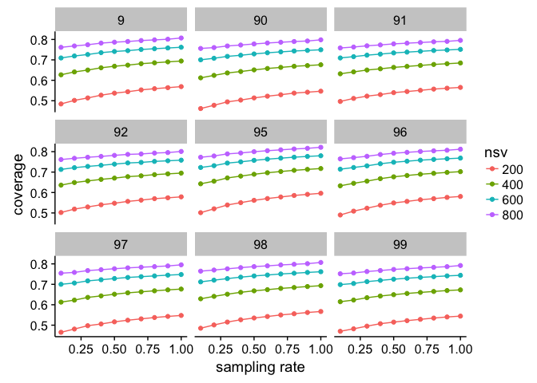
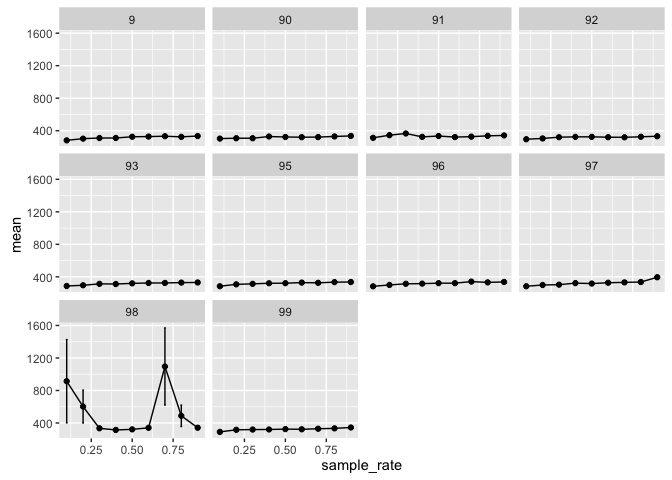
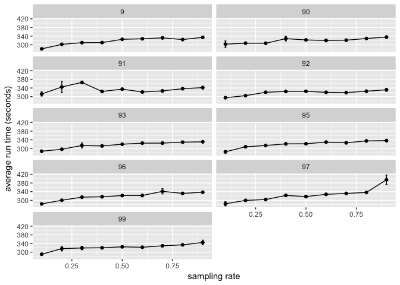
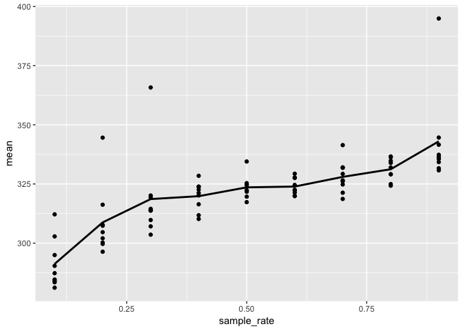
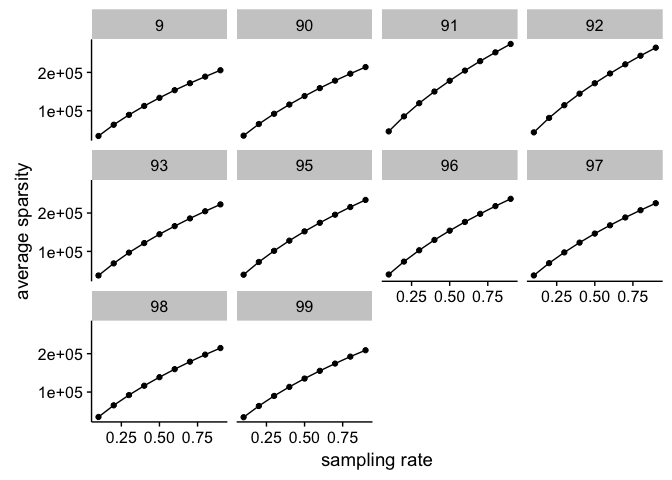
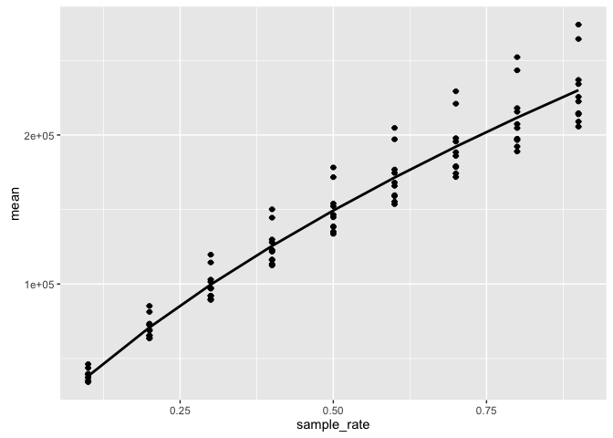

# Matrix sampling


## Overview 
Looking at how sampling rate affect the variances of the matrix. 

The idea is that, the same number of singular values produce the same variance in a sampled matrix as the one in the non-sampled matrix. 

There are 10 matrices, each sampled at different rate [0.1 - 0.9] with three replicates [1-3]. So that's a total of 270 sampled matrices. 

## Import data 
Setting up the required packages and import the data 

```r
library(ggplot2)
library(plyr) # note to self: load this before dplyr always. 
library(dplyr)
```

```
## Warning: package 'dplyr' was built under R version 3.2.5
```

```r
library(magrittr)
```


```r
tf <- read.table("termfreq.summary", header=TRUE)
tf_original <- read.table("tf_original.summary", header = TRUE) 
tfidf <- read.table("tfidf.summary", header=TRUE)
tfidf_original <- read.table("tfidf_original.summary", header=TRUE)
```

## Clean up the data a bit

Just setting some column names.

```r
# Let's separate out the replication and rate  in different columns 
tf <- tf %>% tidyr::separate(matrix_name, c("id", "type", "rate", "replicate"), sep = "_") %>% readr::type_convert()
# Fix column name of tfidf and do the same thing 
tfidf$matrix_name <- gsub(".tfidf", "", tfidf$matrix_name)
tfidf$matrix_name <- gsub("tf", "tfidf", tfidf$matrix_name)
tfidf <- tfidf %>% tidyr::separate(matrix_name, c("id", "type", "rate", "replicate"), sep = "_") %>% readr::type_convert()
```

Combine the data.frames 

```r
# Add the original matrix into the tf data.frame 
tf_original$replicate = "1"
tf_original$rate = 1
tf_original <- tf_original %>% tidyr::separate(matrix_name, c("id", "type"), sep = "[.]")
tf <- rbind(tf, tf_original)

# Add the original to the tfidf data.frame 
tfidf_original$replicate = "1"
tfidf_original$rate = 1
tfidf_original <- tfidf_original %>% tidyr::separate(matrix_name, c("id", "type"), sep = "[.]")
tfidf <- rbind(tfidf, tfidf_original)
```
Fix up the types of the columns 

```r
# combine the two
all <- rbind(tf, tfidf)

# Turn nsv into factor 
all$nsv <- as.factor(all$nsv)
all$id <- as.factor(all$id)
all$type <- as.factor(all$type)
```

What the data look like

```r
head(all)
```

```
##   id type rate replicate forbenius maxAcceptableNSV variance nsv
## 1 99   tf  0.7         1    635283              613 335490.4 200
## 2 99   tf  0.7         1    635283              613 419603.2 400
## 3 99   tf  0.7         1    635283              613 466214.0 600
## 4 99   tf  0.7         1    635283              613 495557.8 800
## 5 97   tf  0.3         2    203749              627 101476.5 200
## 6 97   tf  0.3         2    203749              627 129923.9 400
```

```r
str(all)
```

```
## 'data.frame':	2240 obs. of  8 variables:
##  $ id              : Factor w/ 10 levels "9","90","91",..: 10 10 10 10 8 8 8 8 6 6 ...
##  $ type            : Factor w/ 2 levels "tf","tfidf": 1 1 1 1 1 1 1 1 1 1 ...
##  $ rate            : num  0.7 0.7 0.7 0.7 0.3 0.3 0.3 0.3 0.6 0.6 ...
##  $ replicate       : chr  "1" "1" "1" "1" ...
##  $ forbenius       : num  635283 635283 635283 635283 203749 ...
##  $ maxAcceptableNSV: int  613 613 613 613 627 627 627 627 632 632 ...
##  $ variance        : num  335490 419603 466214 495558 101476 ...
##  $ nsv             : Factor w/ 4 levels "200","400","600",..: 1 2 3 4 1 2 3 4 1 2 ...
```

## Analyzing data

For each grouping of id-rate-nsv, calculate the mean variance and the standard devi


```r
tfidf_summary <- all[all$type=="tfidf", ] %>% dplyr::group_by(id, rate, nsv) %>% dplyr::summarise_at(c("variance", "forbenius"), c("mean", "sd")) %>% dplyr::mutate(cov = variance_mean / forbenius_mean)
tf_summary <- all[all$type=="tf", ] %>% dplyr::group_by(id, rate, nsv) %>% dplyr::summarise_at(c("variance", "forbenius"), c("mean", "sd")) %>% dplyr::mutate(cov = variance_mean / forbenius_mean)
```


```r
head(tf_summary)
```

```
## Source: local data frame [6 x 8]
## Groups: id, rate [2]
## 
##       id  rate    nsv variance_mean forbenius_mean variance_sd
##   <fctr> <dbl> <fctr>         <dbl>          <dbl>       <dbl>
## 1      9   0.1    200      22200.37       45839.67    239.8174
## 2      9   0.1    400      28740.32       45839.67    227.9617
## 3      9   0.1    600      32516.21       45839.67    188.0740
## 4      9   0.1    800      34897.89       45839.67    180.0108
## 5      9   0.2    200      54406.88      108437.33    186.6935
## 6      9   0.2    400      69501.83      108437.33    237.3301
## # ... with 2 more variables: forbenius_sd <dbl>, cov <dbl>
```

## Result

Excluding id 9 to make the facet-wrap 3 by 3. Don't worry, it's not an outlier. 

```r
tf_summary <- tf_summary[tf_summary$id != "9",]
tfidf_summary <- tfidf_summary[tfidf_summary$id != "9",]
```


```r
# Plot the one for tf 
ggplot(tf_summary, aes(x = rate, y = cov, colour = nsv, group = nsv)) + geom_point() + geom_line() + facet_wrap(~id)
```

\
From this plot we can see that lower sampling rate result in smaller coverage, which is measured by taking the ratio of the variance (of given number of singular values) and forbenius norm. The lines are relatively flat and this is consistent across different matrices. This means we could sample the matrix and the same number of singular values would still be representative enough compare to a matrix that's not sampled. 


```r
# Plot tfidf 
ggplot(tfidf_summary, aes(x = rate, y = cov, colour = nsv, group = nsv)) + geom_point() + geom_line() + facet_wrap(~id)
```

\

After some thoughts, I realize that sampling the matrix by taking a subset of the word occurences using a probability rate AND THEN convert the result into TFIDF doesn't really make sense. 

TFIDF(occurrences, term) = (1 + log(occurrences)) * log(nDoc/(nDoc with the term))

Just looking at the first term  TF = 1 + log(occurrences).  1+log(x) where x is an integer 1,2,3..., we can calculate that the change of TF is not constant as X increase.  So I'm not sure if sampling occurrences and then converting the result to TFIDF make sense.  

Therefore, I'll try sampling AFTER converting to TFIDF next time. 

From the look of the graph though, the curves are quite flat and sampling seems to be able to give us a good idea of coverage. 


## Running time

We should sanity-check whether sampling reduces running time and that correlates to less entries in the matrix (next).

Note that we do not include the run time and the sparsity information of non-sampled matrices because SVD for those matrices were run separately, possibly on different machines, so we cannot compare their SVD run time with the sampled matrices. 

Load data

```r
run_time <- read.table("termfreq_runningtime.result", header=TRUE)
run_time$matrix_name <- factor(run_time$matrix_name)
```

Summarize the data by taking the average


```r
get_summary <- function(data) {
  summary <- data %>% dplyr::group_by(matrix_name, sample_rate) %>% dplyr::summarise_at(c("run_time"), c("mean", "sd")) %>% dplyr::mutate(de = sd/sqrt(3) )
}
run_time_summary <- get_summary(run_time)
head(run_time_summary)
```

```
## Source: local data frame [6 x 5]
## Groups: matrix_name [1]
## 
##   matrix_name sample_rate     mean       sd        de
##        <fctr>       <dbl>    <dbl>    <dbl>     <dbl>
## 1           9         0.1 281.1663 2.243410 1.2952335
## 2           9         0.2 302.0427 3.329655 1.9223772
## 3           9         0.3 309.7610 8.837418 5.1022854
## 4           9         0.4 310.2207 2.714430 1.5671769
## 5           9         0.5 325.3613 0.564532 0.3259327
## 6           9         0.6 327.7363 7.276033 4.2008195
```

Graph result 


```r
ggplot(run_time_summary, aes(x = sample_rate, y = mean)) + geom_point() + geom_line() + geom_errorbar(aes(ymax = mean + de, ymin=mean - de), width=0.01) +  facet_wrap(~matrix_name)
```

\

Make 3 by 3 

```r
ggplot(run_time_summary[run_time_summary$matrix_name!="98", ], aes(x = sample_rate, y = mean)) + geom_point() + geom_line() + geom_errorbar(aes(ymax = mean + de, ymin=mean - de), width=0.01) +  facet_wrap(~matrix_name)
```

\

Combine all matrices


```r
ggplot(run_time_summary[run_time_summary$matrix_name!="98", ], aes(x = sample_rate, y = mean)) + geom_point() + stat_summary(fun.y = mean, geom="line", size=1.0)
```

\


## Sparsity 

Load data

```r
sparsity <- read.table("sparsity_tf.result", header=TRUE)
str(sparsity)
```

```
## 'data.frame':	270 obs. of  3 variables:
##  $ matrix_name: int  90 90 90 90 90 90 90 90 90 90 ...
##  $ sample_rate: num  0.1 0.1 0.1 0.2 0.2 0.2 0.3 0.3 0.3 0.4 ...
##  $ n_entries  : int  35136 35032 35235 65676 65119 65580 92159 91905 92251 116142 ...
```

```r
sparsity$matrix_name <- factor(sparsity$matrix_name)
```

Summarize the data by taking the average


```r
get_summary <- function(data) {
  summary <- data %>% dplyr::group_by(matrix_name, sample_rate) %>% dplyr::summarise_at(c("n_entries"), c("mean", "sd")) %>% dplyr::mutate(de = sd/sqrt(3) )
}
sparsity_summary <- get_summary(sparsity)
head(sparsity_summary)
```

```
## Source: local data frame [6 x 5]
## Groups: matrix_name [1]
## 
##   matrix_name sample_rate      mean       sd        de
##        <fctr>       <dbl>     <dbl>    <dbl>     <dbl>
## 1           9         0.1  34212.67 168.2033  97.11219
## 2           9         0.2  63557.33 140.9054  81.35177
## 3           9         0.3  89289.33 333.0005 192.25793
## 4           9         0.4 112490.67 241.2164 139.26633
## 5           9         0.5 133667.67 220.2733 127.17486
## 6           9         0.6 153599.33 274.0663 158.23225
```

Graph result 


```r
ggplot(sparsity_summary, aes(x = sample_rate, y = mean)) + geom_point() + geom_line() + geom_errorbar(aes(ymax = mean + de, ymin=mean - de), width=0.01) +  facet_wrap(~matrix_name)
```

\

Make 3 by 3 

```r
ggplot(sparsity_summary[sparsity_summary$matrix_name!="9", ], aes(x = sample_rate, y = mean)) + geom_point() + geom_line() + geom_errorbar(aes(ymax = mean + de, ymin=mean - de), width=0.01) +  facet_wrap(~matrix_name)
```

\

Sampling is fairly consistent at producing matrices with the same sparsity. 

Combine different matrices together 

```r
ggplot(sparsity_summary, aes(x = sample_rate, y = mean)) + geom_point() + geom_errorbar(aes(ymax = mean + de, ymin=mean - de), width=0.01) + stat_summary(fun.y = mean, geom="line", size=1.0)
```

\
