Matrix sampling
================

Overview
--------

Looking at how sampling rate affect the variances of the matrix.

The idea is that, the same number of singular values produce the same variance in a sampled matrix as the one in the non-sampled matrix.

There are 10 matrices, each sampled at different rate \[0.1 - 0.9\] with three replicates \[1-3\]. So that's a total of 270 sampled matrices.

Import data
-----------

Setting up the required packages and import the data

``` r
library(ggplot2)
library(plyr) # note to self: load this before dplyr always. 
library(dplyr)
library(magrittr)
```

``` r
tf <- read.table("termfreq.summary", header=TRUE)
tf_original <- read.table("tf_original.summary", header = TRUE) 
tfidf <- read.table("tfidf.summary", header=TRUE)
tfidf_original <- read.table("tfidf_original.summary", header=TRUE)
```

**Fixing my original calculation** On Dec 20, I found that I forgot to take the square root of my frobenius norm and variance (sum of squares). Therefore, I'm doing it now to fix it with in the dataset itself to avoid having to rerun the command.

``` r
tf <- transform(tf, forbenius=sqrt(forbenius), variance=sqrt(variance))
tf_original <- transform(tf_original, forbenius=sqrt(forbenius), variance=sqrt(variance))
tfidf <- transform(tfidf, forbenius=sqrt(forbenius), variance=sqrt(variance))
tfidf_original <- transform(tfidf_original, forbenius=sqrt(forbenius), variance=sqrt(variance))
```

Clean up the data a bit
-----------------------

Just setting some column names.

``` r
# Let's separate out the replication and rate  in different columns 
tf <- tf %>% tidyr::separate(matrix_name, c("id", "type", "rate", "replicate"), sep = "_") %>% readr::type_convert()
# Fix column name of tfidf and do the same thing 
tfidf$matrix_name <- gsub(".tfidf", "", tfidf$matrix_name)
tfidf$matrix_name <- gsub("tf", "tfidf", tfidf$matrix_name)
tfidf <- tfidf %>% tidyr::separate(matrix_name, c("id", "type", "rate", "replicate"), sep = "_") %>% readr::type_convert()
```

Combine the data.frames

``` r
# Add the original matrix into the tf data.frame 
tf_original$replicate = "1"
tf_original$rate = 1
tf_original <- tf_original %>% tidyr::separate(matrix_name, c("id", "type"), sep = "[.]")
tf <- rbind(tf, tf_original)

# Add the original to the tfidf data.frame 
tfidf_original$replicate = "1"
tfidf_original$rate = 1
tfidf_original <- tfidf_original %>% tidyr::separate(matrix_name, c("id", "type"), sep = "[.]")
tfidf <- rbind(tfidf, tfidf_original)
```

Fix up the types of the columns

``` r
# combine the two
all <- rbind(tf, tfidf)

# Turn nsv into factor 
all$nsv <- as.factor(all$nsv)
all$id <- as.factor(all$id)
all$type <- as.factor(all$type)
```

Analyzing data
--------------

For each grouping of id-rate-nsv, calculate the mean variance and the standard devi

``` r
tfidf_summary <- all[all$type=="tfidf", ] %>% dplyr::group_by(id, rate, nsv) %>% dplyr::summarise_at(c("variance", "forbenius"), c("mean", "sd")) %>% dplyr::mutate(cov = variance_mean / forbenius_mean)
tf_summary <- all[all$type=="tf", ] %>% dplyr::group_by(id, rate, nsv) %>% dplyr::summarise_at(c("variance", "forbenius"), c("mean", "sd")) %>% dplyr::mutate(cov = variance_mean / forbenius_mean)
```

Result
------

Excluding id 93 to make the facet-wrap 3 by 3. Don't worry, it's not an outlier.

``` r
#tf_summary <- tf_summary[tf_summary$id != "93",]
#tfidf_summary <- tfidf_summary[tfidf_summary$id != "93",]
# Plot the one for tf 
ggplot(tf_summary, aes(x = rate, y = cov, colour = nsv, group = nsv)) + geom_point() + geom_line() + facet_wrap(~id, nrow=2, scales="fixed", shrink=FALSE) + ylab("coverage") + xlab("sampling rate") + theme_bw()
```

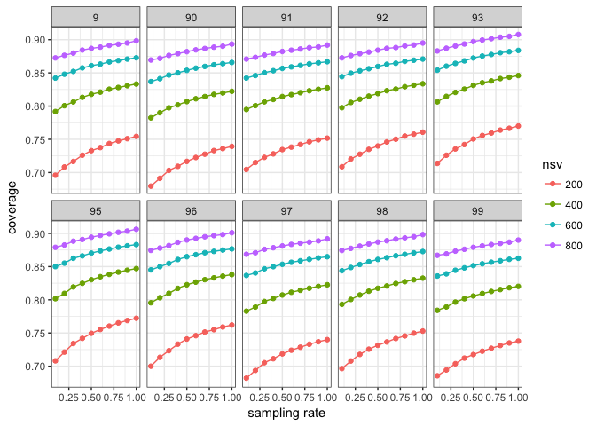

From this plot we can see that lower sampling rate result in smaller coverage, which is measured by taking the ratio of the variance (of given number of singular values) and forbenius norm. The lines are relatively flat and this is consistent across different matrices. This means we could sample the matrix and the same number of singular values would still be representative enough compare to a matrix that's not sampled.

``` r
# Plot tfidf 
ggplot(tfidf_summary, aes(x = rate, y = cov, colour = nsv, group = nsv)) + geom_point() + geom_line() + facet_wrap(~id, nrow=2) + ylab("coverage") + xlab("sampling rate")  + theme_bw()
```

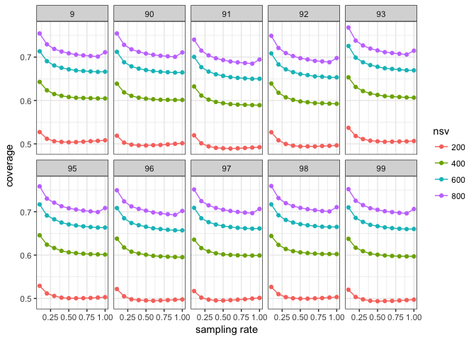

After some thoughts, I realize that sampling the matrix by taking a subset of the word occurences using a probability rate AND THEN convert the result into TFIDF doesn't really make sense.

TFIDF(occurrences, term) = (1 + log(occurrences)) \* log(nDoc/(nDoc with the term))

Just looking at the first term TF = 1 + log(occurrences). 1+log(x) where x is an integer 1,2,3..., we can calculate that the change of TF is not constant as X increase. So I'm not sure if sampling occurrences and then converting the result to TFIDF make sense.

Therefore, I'll try sampling AFTER converting to TFIDF next time.

From the look of the graph though, the curves are quite flat and sampling seems to be able to give us a good idea of coverage.

Look at error estimates and singular values
-------------------------------------------

``` r
# Data process. Loading from my own project space because I don't want to commit the result file. 
svals_tf <- read.table("/projects/slin_prj/PubMed_Experiment/graph_sparsification/svals_sampled_tf.result", header=TRUE)
svals_tf <- svals_tf %>% dplyr::group_by(matrix_name, rate, rank) %>% dplyr::summarise_at(c("singular_value", "error_estimate"), c("mean", "sd"))
svals_tf <- svals_tf %>% tidyr::separate(matrix_name, c("id", "sampled", "type"), sep = "[.]") # simplify matrix name 
svals_tf$rate <- factor(svals_tf$rate)

# Graph
ggplot(svals_tf, aes(x=rank, y=error_estimate_mean, colour=rate)) + geom_point(alpha=0.5, size=0.5) + facet_wrap(~id, nrow=2, scale="free") + scale_color_brewer(palette="Spectral") + theme(axis.text.x = element_text(size = 9))  + ylab("means of error estimates") + theme_bw() + scale_x_continuous(breaks = seq(0, 1000, 500))
```

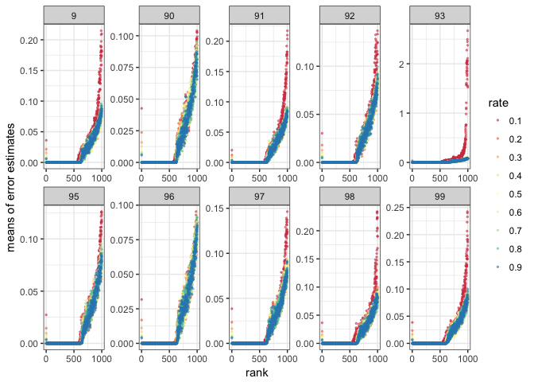

``` r
# Excluding 93 to see the others better. 
ggplot(svals_tf[svals_tf$id != "93", ], aes(x=rank, y=error_estimate_mean, colour=rate)) + geom_point(alpha=0.5, size=0.5) + facet_wrap(~id) + scale_color_brewer(palette="Spectral") + ylab("means of error estimate")
```

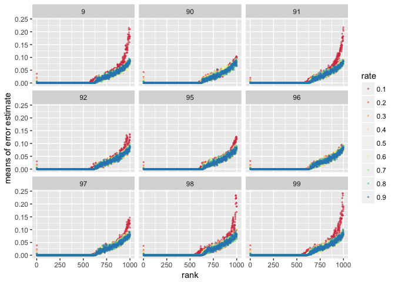 From the look of it, the error estimate are similar for matrices sampled at different rate. Powergraph's error of singular value estimates are similar for the same matrix sampled at different rate.

A look at the singular values

``` r
ggplot(svals_tf, aes(x=rank, y=singular_value_mean, colour=rate)) + geom_point(alpha=0.5, size=0.5) + facet_wrap(~id, nrow=2) + scale_color_brewer(palette="Spectral") + ylab("singular value") + theme(axis.text.x = element_text(size = 9)) + theme_bw()
```

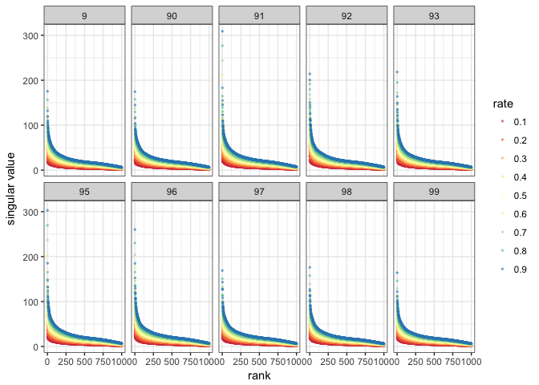

``` r
# Exclude 93 for 3 by 3 
ggplot(svals_tf[svals_tf$id != "93", ], aes(x=rank, y=singular_value_mean, colour=rate)) + geom_point(alpha=0.5, size=0.5) + facet_wrap(~id) + scale_color_brewer(palette="Spectral") + ylab("singular value")
```

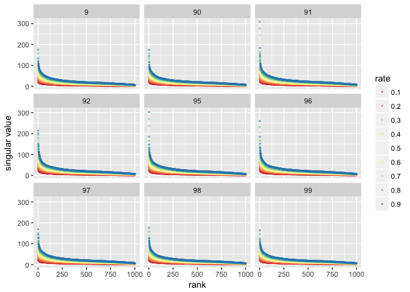

Singular values are greater for those that are sampled at a higher rate and decay slower.

Running time
------------

We should sanity-check whether sampling reduces running time and that correlates to less entries in the matrix (next).

Note that we do not include the run time and the sparsity information of non-sampled matrices because SVD for those matrices were run separately, possibly on different machines, so we cannot compare their SVD run time with the sampled matrices.

Load data

``` r
run_time <- read.table("termfreq_runningtime.result", header=TRUE)
run_time$matrix_name <- factor(run_time$matrix_name)
```

Summarize the data by taking the average

``` r
get_summary <- function(data) {
  summary <- data %>% dplyr::group_by(matrix_name, sample_rate) %>% dplyr::summarise_at(c("run_time"), c("mean", "sd")) %>% dplyr::mutate(de = sd/sqrt(3) )
}
run_time_summary <- get_summary(run_time)
```

Graph result

``` r
ggplot(run_time_summary, aes(x = sample_rate, y = mean)) + geom_point() + geom_line() + geom_errorbar(aes(ymax = mean + de, ymin=mean - de), width=0.01) +  facet_wrap(~matrix_name, nrow=2, scale="free") + ylab("average run time (seconds)") + xlab("sampling rate") + theme_bw()
```

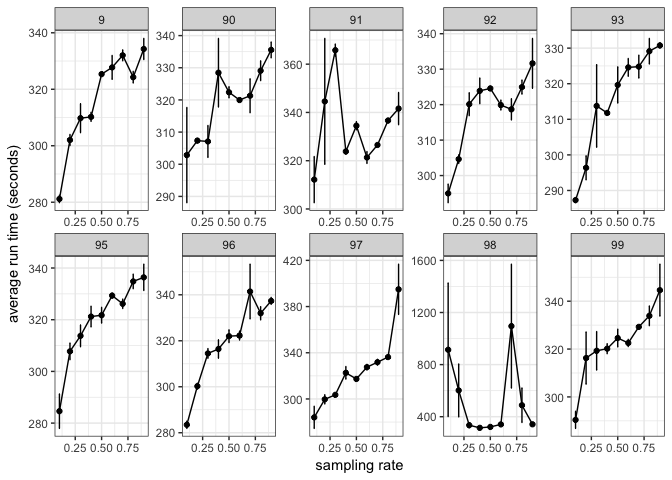

Make 3 by 3

``` r
ggplot(run_time_summary[run_time_summary$matrix_name!="98", ], aes(x = sample_rate, y = mean)) + geom_point() + geom_line() + geom_errorbar(aes(ymax = mean + de, ymin=mean - de), width=0.01) +  facet_wrap(~matrix_name, ncol=2) + ylab("average run time (seconds)") + xlab("sampling rate")
```

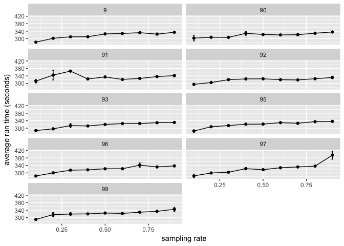

Combine all matrices

``` r
ggplot(run_time_summary[run_time_summary$matrix_name!="98", ], aes(x = sample_rate, y = mean)) + geom_point() + stat_summary(fun.y = mean, geom="line", size=1.0) + ylab("average run time (seconds)") + xlab("sampling rate")
```

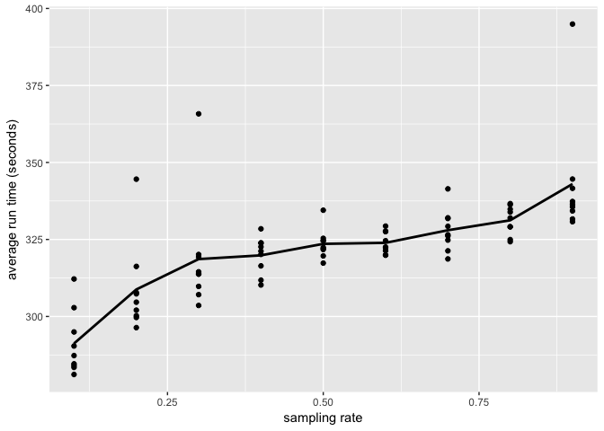

Sparsity
--------

Load data

``` r
sparsity <- read.table("sparsity_tf.result", header=TRUE)
str(sparsity)
```

    ## 'data.frame':    270 obs. of  3 variables:
    ##  $ matrix_name: int  90 90 90 90 90 90 90 90 90 90 ...
    ##  $ sample_rate: num  0.1 0.1 0.1 0.2 0.2 0.2 0.3 0.3 0.3 0.4 ...
    ##  $ n_entries  : int  35136 35032 35235 65676 65119 65580 92159 91905 92251 116142 ...

``` r
sparsity$matrix_name <- factor(sparsity$matrix_name)
```

Summarize the data by taking the average

``` r
get_summary <- function(data) {
  summary <- data %>% dplyr::group_by(matrix_name, sample_rate) %>% dplyr::summarise_at(c("n_entries"), c("mean", "sd")) %>% dplyr::mutate(de = sd/sqrt(3) )
}
sparsity_summary <- get_summary(sparsity)
```

Graph result

``` r
ggplot(sparsity_summary, aes(x = sample_rate, y = mean)) + geom_point() + geom_line() + geom_errorbar(aes(ymax = mean + de, ymin=mean - de), width=0.01) +  facet_wrap(~matrix_name, nrow=2) + ylab("Average number of entries") + xlab("sampling rate") + theme_bw()
```

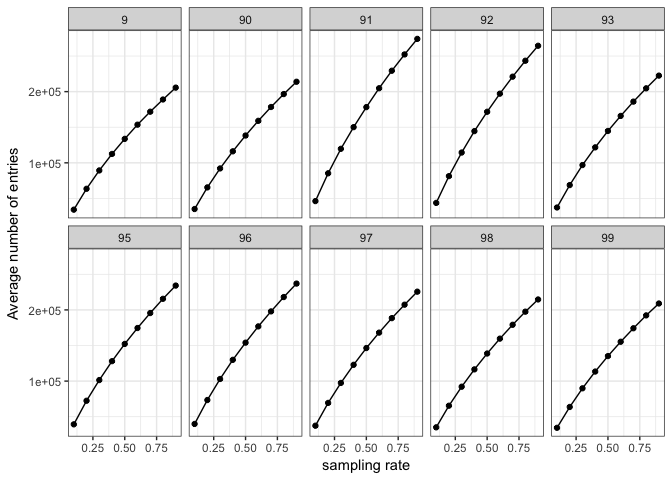

Make 3 by 3

``` r
ggplot(sparsity_summary[sparsity_summary$matrix_name!="9", ], aes(x = sample_rate, y = mean)) + geom_point() + geom_line() + geom_errorbar(aes(ymax = mean + de, ymin=mean - de), width=0.01) +  facet_wrap(~matrix_name) + ylab("Average number of entries") + xlab("sampling rate")
```

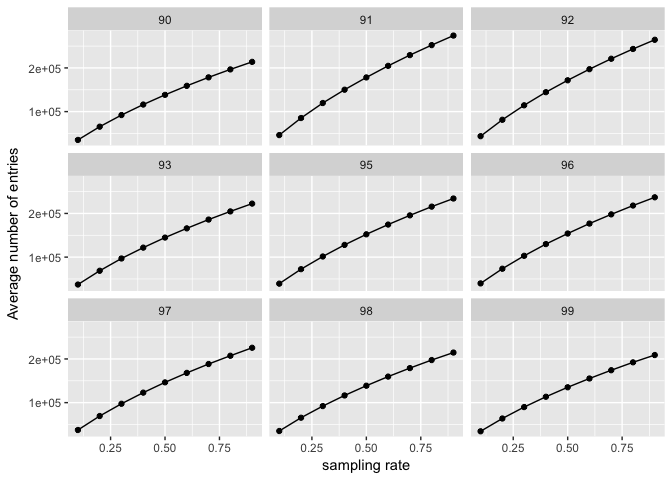

Sampling is fairly consistent at producing matrices with the same sparsity.

Combine different matrices together

``` r
ggplot(sparsity_summary, aes(x = sample_rate, y = mean)) + geom_point() + geom_errorbar(aes(ymax = mean + de, ymin=mean - de), width=0.01) + stat_summary(fun.y = mean, geom="line", size=1.0) + ylab("average sparsity") + xlab("sampling rate")
```

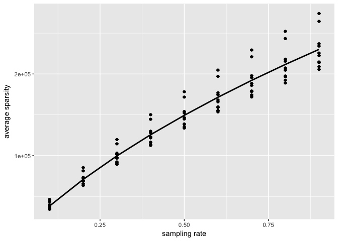
