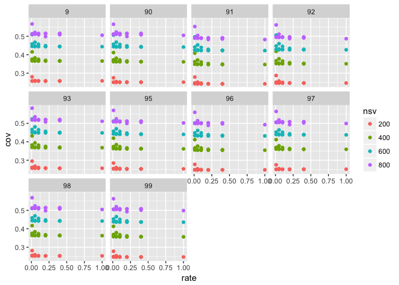
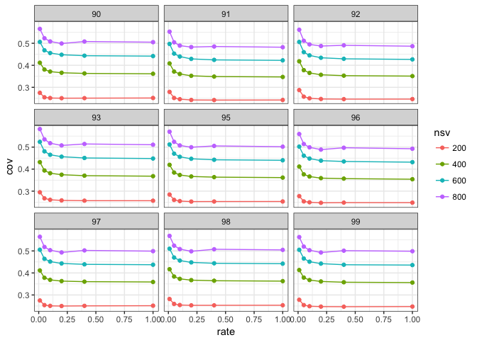
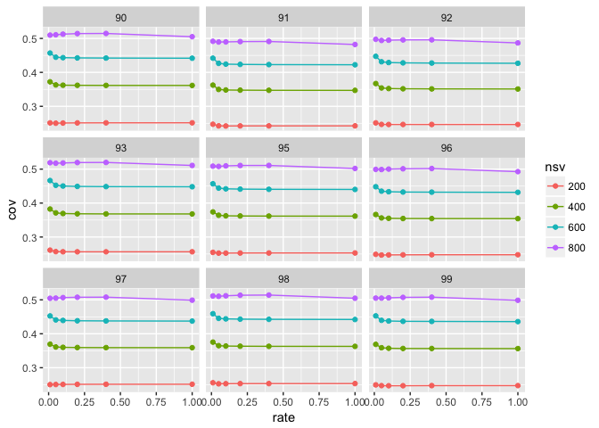
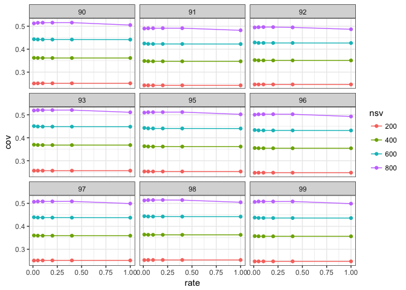
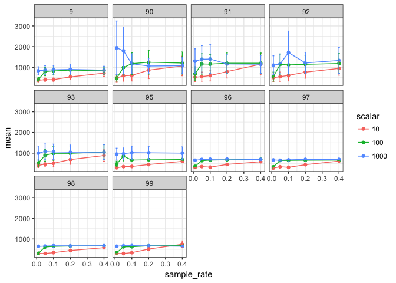
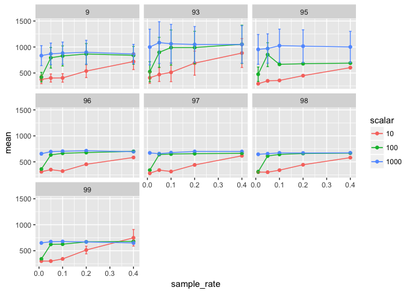
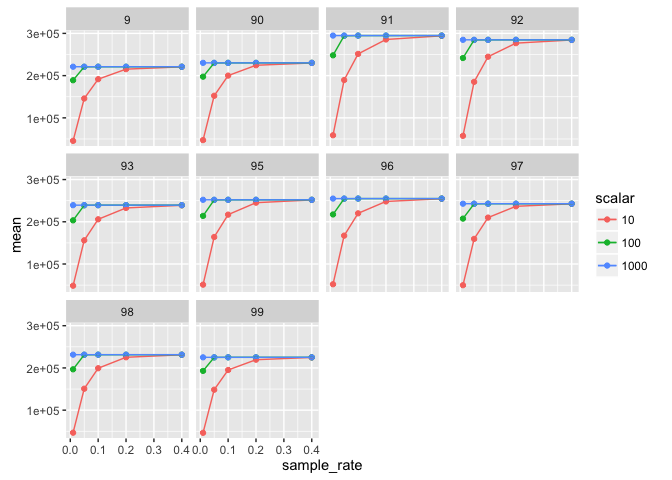
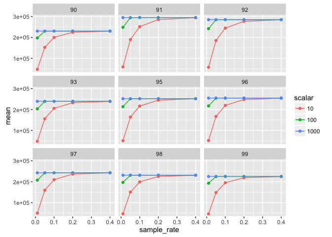

# Matrix sampling for TFIDF
Santina Lin  
November 9, 2016  

## Overview 
Looking at how sampling rate affect the variances of the matrix. 

The idea is that, the same number of singular values produce the same variance in a sampled matrix as the one in the original non-sampled matrix. 

In this experiment, we first convert the original term-frequency into TFIDF (term-frequency-inverse-document-frequency) and then multiply them by a factor (10, 100, 1000), sample at various rates (0.01, 0.05, 0.1, 0.2, 0.4) with three replicates [1-3]. Since there are 10 different original matrices, that's a total of 450 sampled matrices. 

We then do SVD on each of the matrices (nsv = 800) and see how the coverage (ratio of total variance for a given NSV to the forbenius norm of the original matrix)

## Data
Setting up the required packages and import the data 

```r
library(ggplot2)
library(plyr) # note to self: load this before dplyr always. 
library(dplyr)
```

```
## Warning: package 'dplyr' was built under R version 3.2.5
```

```r
library(magrittr)
```
Get the data

```r
tfidf <- read.table("TFIDF.result", header=TRUE)
tfidf_original <- read.table("tfidf_original.summary", header=TRUE)
```
Inspect data 

```r
str(tfidf)
```

```
## 'data.frame':	1800 obs. of  5 variables:
##  $ matrix_name     : Factor w/ 450 levels "9.tfidf_10_0.01_1",..: 148 148 148 148 150 150 150 150 149 149 ...
##  $ forbenius       : num  31268205 31268205 31268205 31268205 31203386 ...
##  $ maxAcceptableNSV: int  213 213 213 213 215 215 215 215 207 207 ...
##  $ variance        : num  7691816 11024922 13408814 15319359 7694528 ...
##  $ nsv             : int  200 400 600 800 200 400 600 800 200 400 ...
```

```r
str(tfidf_original)
```

```
## 'data.frame':	40 obs. of  5 variables:
##  $ matrix_name     : Factor w/ 10 levels "9.tfidf","90.tfidf",..: 1 1 1 1 10 10 10 10 7 7 ...
##  $ forbenius       : num  1489177 1489177 1489177 1489177 1500227 ...
##  $ maxAcceptableNSV: int  709 709 709 709 718 718 718 718 715 715 ...
##  $ variance        : num  384694 544726 661040 753233 371051 ...
##  $ nsv             : int  200 400 600 800 200 400 600 800 200 400 ...
```

Cleaning up the data to extract out information in the names

```r
# Let's separate out the replication and rate  in different columns 
tfidf <- tfidf %>% tidyr::separate(matrix_name, c("matrix_name", "scalar", "rate", "replicate"), sep = "_") %>% readr::type_convert()
# Fix column name of tfidf and do the same thing 
tfidf$matrix_name <- as.factor(gsub(".tfidf", "", tfidf$matrix_name))
tfidf$nsv <- as.factor(tfidf$nsv)

# Fix tfidf_original to prepare for a rbind
tfidf_original$replicate = 1
tfidf_original$rate = 1
tfidf_original$scalar = 1
tfidf_original$matrix_name <- as.factor(gsub(".tfidf", "", tfidf_original$matrix_name))
tfidf_original$nsv <- as.factor(tfidf_original$nsv)


# rbind and set factors as necessary
all <- rbind(tfidf, tfidf_original)
all$scalar <- as.factor(all$scalar)
```

## Calculate coverage 


```r
get_summary <- function(data) {
  summary <- data %>% dplyr::group_by(matrix_name, rate, nsv, scalar) %>% dplyr::summarise_at(c("variance", "forbenius"), c("mean", "sd")) %>% dplyr::mutate(cov = variance_mean / forbenius_mean)
}

tfidf_summary <- get_summary(all)
```


## Result 

```r
# Plot tfidf 
ggplot(tfidf_summary, aes(x = rate, y = cov, colour = nsv, group = nsv)) + geom_point() + facet_wrap(~matrix_name)
```

\

## See the difference in scalar

First let me remove matrix 9 so that the facet_wrap can be 3 by 3. 

```r
tfidf_original <- tfidf_original[tfidf_original$matrix_name != "9",]
tfidf <- tfidf[tfidf$matrix_name != "9",]
```


Scalar = 10

```r
# Create different data.frame for different scalar group (including the sample = 1 group)
all_10 <- rbind(tfidf_original, tfidf[tfidf$scalar==10,])
all_10 <- get_summary(all_10)
ggplot(all_10, aes(x = rate, y = cov, colour = nsv, group = nsv)) + geom_point() + geom_line() +  facet_wrap(~matrix_name)
```

\

Scalar = 100

```r
all_100 <- rbind(tfidf_original, tfidf[tfidf$scalar==100,])
all_100 <- get_summary(all_100)
ggplot(all_100, aes(x = rate, y = cov, colour = nsv, group = nsv)) + geom_point() + geom_line() +  facet_wrap(~matrix_name)
```

\

Scalar = 1000

```r
all_1000 <- rbind(tfidf_original, tfidf[tfidf$scalar==1000,])
all_1000 <- get_summary(all_1000)
ggplot(all_1000, aes(x = rate, y = cov, colour = nsv, group = nsv)) + geom_point() + geom_line() +  facet_wrap(~matrix_name)
```

\

## Running time 

Load data

```r
run_time <- read.table("tfidf_runningtime.result", header=TRUE)
str(run_time)
```

```
## 'data.frame':	450 obs. of  4 variables:
##  $ matrix_name: int  90 90 90 90 90 90 90 90 90 90 ...
##  $ scalar     : int  1000 1000 1000 1000 1000 1000 100 1000 100 1000 ...
##  $ sample_rate: num  0.01 0.01 0.01 0.05 0.05 0.05 0.01 0.1 0.01 0.1 ...
##  $ run_time   : num  652 639 4536 679 663 ...
```

```r
run_time$scalar <- factor(run_time$scalar)
run_time$matrix_name <- factor(run_time$matrix_name)
```

Summarize the data by taking the average


```r
get_summary <- function(data) {
  summary <- data %>% dplyr::group_by(matrix_name, sample_rate, scalar) %>% dplyr::summarise_at(c("run_time"), c("mean", "sd")) %>% dplyr::mutate(de = sd/sqrt(3) )
}

run_time_summary <- get_summary(run_time)
str(run_time_summary)
```

```
## Classes 'grouped_df', 'tbl_df', 'tbl' and 'data.frame':	150 obs. of  6 variables:
##  $ matrix_name: Factor w/ 10 levels "9","90","91",..: 1 1 1 1 1 1 1 1 1 1 ...
##  $ sample_rate: num  0.01 0.01 0.01 0.05 0.05 0.05 0.1 0.1 0.1 0.2 ...
##  $ scalar     : Factor w/ 3 levels "10","100","1000": 1 2 3 1 2 3 1 2 3 1 ...
##  $ mean       : num  377 421 834 404 793 ...
##  $ sd         : num  141 158 333 136 344 ...
##  $ de         : num  81.4 91.5 192.1 78.4 198.5 ...
##  - attr(*, "vars")=List of 2
##   ..$ : symbol matrix_name
##   ..$ : symbol sample_rate
##  - attr(*, "labels")='data.frame':	50 obs. of  2 variables:
##   ..$ matrix_name: Factor w/ 10 levels "9","90","91",..: 1 1 1 1 1 2 2 2 2 2 ...
##   ..$ sample_rate: num  0.01 0.05 0.1 0.2 0.4 0.01 0.05 0.1 0.2 0.4 ...
##   ..- attr(*, "vars")=List of 2
##   .. ..$ : symbol matrix_name
##   .. ..$ : symbol sample_rate
##   ..- attr(*, "drop")= logi TRUE
##  - attr(*, "indices")=List of 50
##   ..$ : int  0 1 2
##   ..$ : int  3 4 5
##   ..$ : int  6 7 8
##   ..$ : int  9 10 11
##   ..$ : int  12 13 14
##   ..$ : int  15 16 17
##   ..$ : int  18 19 20
##   ..$ : int  21 22 23
##   ..$ : int  24 25 26
##   ..$ : int  27 28 29
##   ..$ : int  30 31 32
##   ..$ : int  33 34 35
##   ..$ : int  36 37 38
##   ..$ : int  39 40 41
##   ..$ : int  42 43 44
##   ..$ : int  45 46 47
##   ..$ : int  48 49 50
##   ..$ : int  51 52 53
##   ..$ : int  54 55 56
##   ..$ : int  57 58 59
##   ..$ : int  60 61 62
##   ..$ : int  63 64 65
##   ..$ : int  66 67 68
##   ..$ : int  69 70 71
##   ..$ : int  72 73 74
##   ..$ : int  75 76 77
##   ..$ : int  78 79 80
##   ..$ : int  81 82 83
##   ..$ : int  84 85 86
##   ..$ : int  87 88 89
##   ..$ : int  90 91 92
##   ..$ : int  93 94 95
##   ..$ : int  96 97 98
##   ..$ : int  99 100 101
##   ..$ : int  102 103 104
##   ..$ : int  105 106 107
##   ..$ : int  108 109 110
##   ..$ : int  111 112 113
##   ..$ : int  114 115 116
##   ..$ : int  117 118 119
##   ..$ : int  120 121 122
##   ..$ : int  123 124 125
##   ..$ : int  126 127 128
##   ..$ : int  129 130 131
##   ..$ : int  132 133 134
##   ..$ : int  135 136 137
##   ..$ : int  138 139 140
##   ..$ : int  141 142 143
##   ..$ : int  144 145 146
##   ..$ : int  147 148 149
##  - attr(*, "drop")= logi TRUE
##  - attr(*, "group_sizes")= int  3 3 3 3 3 3 3 3 3 3 ...
##  - attr(*, "biggest_group_size")= int 3
```

```r
head(run_time_summary)
```

```
## Source: local data frame [6 x 6]
## Groups: matrix_name, sample_rate [2]
## 
##   matrix_name sample_rate scalar     mean       sd        de
##        <fctr>       <dbl> <fctr>    <dbl>    <dbl>     <dbl>
## 1           9        0.01     10 376.5380 140.9339  81.36824
## 2           9        0.01    100 420.6820 158.4750  91.49557
## 3           9        0.01   1000 834.1340 332.7937 192.13852
## 4           9        0.05     10 403.5013 135.7248  78.36076
## 5           9        0.05    100 793.2150 343.8925 198.54642
## 6           9        0.05   1000 868.5517 358.8197 207.16467
```

Graph result 


```r
ggplot(run_time_summary, aes(x = sample_rate, y = mean, colour = scalar, group = scalar)) + geom_point() + geom_line() + geom_errorbar(aes(ymax = mean + de, ymin=mean - de), width=0.01) +  facet_wrap(~matrix_name)
```

\

Remove 90, 91, and 92 to show the data better. 

```r
run_time_summary_subset <- subset(run_time_summary, !matrix_name %in% c("90", "91", "92"))
ggplot(run_time_summary_subset, aes(x = sample_rate, y = mean, colour = scalar, group = scalar)) + geom_point() + geom_line() + geom_errorbar(aes(ymax = mean + de, ymin=mean - de), width=0.01) +  facet_wrap(~matrix_name)
```

\


## Sparsity 

Load data

```r
sparsity <- read.table("sparsity_TFIDF.result", header=TRUE)
str(sparsity)
```

```
## 'data.frame':	450 obs. of  4 variables:
##  $ matrix_name: int  90 90 90 90 90 90 90 90 90 90 ...
##  $ scalar     : int  1000 1000 1000 1000 1000 1000 100 1000 100 1000 ...
##  $ sample_rate: num  0.01 0.01 0.01 0.05 0.05 0.05 0.01 0.1 0.01 0.1 ...
##  $ n_entries  : int  230218 230215 230215 230223 230223 230223 197416 230223 197552 230223 ...
```

```r
sparsity$scalar <- factor(run_time$scalar)
sparsity$matrix_name <- factor(run_time$matrix_name)
```

Summarize the data by taking the average


```r
get_summary <- function(data) {
  summary <- data %>% dplyr::group_by(matrix_name, sample_rate, scalar) %>% dplyr::summarise_at(c("n_entries"), c("mean", "sd")) %>% dplyr::mutate(de = sd/sqrt(3) )
}

sparsity_summary <- get_summary(sparsity)
str(sparsity_summary)
```

```
## Classes 'grouped_df', 'tbl_df', 'tbl' and 'data.frame':	150 obs. of  6 variables:
##  $ matrix_name: Factor w/ 10 levels "9","90","91",..: 1 1 1 1 1 1 1 1 1 1 ...
##  $ sample_rate: num  0.01 0.01 0.01 0.05 0.05 0.05 0.1 0.1 0.1 0.2 ...
##  $ scalar     : Factor w/ 3 levels "10","100","1000": 1 2 3 1 2 3 1 2 3 1 ...
##  $ mean       : num  45516 189102 221069 145851 220812 ...
##  $ sd         : num  99.77 274.4 2.08 173.81 18.36 ...
##  $ de         : num  57.6 158.4 1.2 100.3 10.6 ...
##  - attr(*, "vars")=List of 2
##   ..$ : symbol matrix_name
##   ..$ : symbol sample_rate
##  - attr(*, "labels")='data.frame':	50 obs. of  2 variables:
##   ..$ matrix_name: Factor w/ 10 levels "9","90","91",..: 1 1 1 1 1 2 2 2 2 2 ...
##   ..$ sample_rate: num  0.01 0.05 0.1 0.2 0.4 0.01 0.05 0.1 0.2 0.4 ...
##   ..- attr(*, "vars")=List of 2
##   .. ..$ : symbol matrix_name
##   .. ..$ : symbol sample_rate
##   ..- attr(*, "drop")= logi TRUE
##  - attr(*, "indices")=List of 50
##   ..$ : int  0 1 2
##   ..$ : int  3 4 5
##   ..$ : int  6 7 8
##   ..$ : int  9 10 11
##   ..$ : int  12 13 14
##   ..$ : int  15 16 17
##   ..$ : int  18 19 20
##   ..$ : int  21 22 23
##   ..$ : int  24 25 26
##   ..$ : int  27 28 29
##   ..$ : int  30 31 32
##   ..$ : int  33 34 35
##   ..$ : int  36 37 38
##   ..$ : int  39 40 41
##   ..$ : int  42 43 44
##   ..$ : int  45 46 47
##   ..$ : int  48 49 50
##   ..$ : int  51 52 53
##   ..$ : int  54 55 56
##   ..$ : int  57 58 59
##   ..$ : int  60 61 62
##   ..$ : int  63 64 65
##   ..$ : int  66 67 68
##   ..$ : int  69 70 71
##   ..$ : int  72 73 74
##   ..$ : int  75 76 77
##   ..$ : int  78 79 80
##   ..$ : int  81 82 83
##   ..$ : int  84 85 86
##   ..$ : int  87 88 89
##   ..$ : int  90 91 92
##   ..$ : int  93 94 95
##   ..$ : int  96 97 98
##   ..$ : int  99 100 101
##   ..$ : int  102 103 104
##   ..$ : int  105 106 107
##   ..$ : int  108 109 110
##   ..$ : int  111 112 113
##   ..$ : int  114 115 116
##   ..$ : int  117 118 119
##   ..$ : int  120 121 122
##   ..$ : int  123 124 125
##   ..$ : int  126 127 128
##   ..$ : int  129 130 131
##   ..$ : int  132 133 134
##   ..$ : int  135 136 137
##   ..$ : int  138 139 140
##   ..$ : int  141 142 143
##   ..$ : int  144 145 146
##   ..$ : int  147 148 149
##  - attr(*, "drop")= logi TRUE
##  - attr(*, "group_sizes")= int  3 3 3 3 3 3 3 3 3 3 ...
##  - attr(*, "biggest_group_size")= int 3
```

```r
head(sparsity_summary)
```

```
## Source: local data frame [6 x 6]
## Groups: matrix_name, sample_rate [2]
## 
##   matrix_name sample_rate scalar      mean         sd        de
##        <fctr>       <dbl> <fctr>     <dbl>      <dbl>     <dbl>
## 1           9        0.01     10  45516.33  99.771405  57.60305
## 2           9        0.01    100 189102.33 274.403596 158.42699
## 3           9        0.01   1000 221068.67   2.081666   1.20185
## 4           9        0.05     10 145851.33 173.808324 100.34828
## 5           9        0.05    100 220812.00  18.357560  10.59874
## 6           9        0.05   1000 221073.00   0.000000   0.00000
```

Graph result 


```r
ggplot(sparsity_summary, aes(x = sample_rate, y = mean, colour = scalar, group = scalar)) + geom_point() + geom_line() + geom_errorbar(aes(ymax = mean + de, ymin=mean - de), width=0.01) +  facet_wrap(~matrix_name)
```

\

Make 3 by 3 

```r
ggplot(sparsity_summary[sparsity_summary$matrix_name!="9", ], aes(x = sample_rate, y = mean, colour = scalar, group = scalar)) + geom_point() + geom_line() + geom_errorbar(aes(ymax = mean + de, ymin=mean - de), width=0.01) +  facet_wrap(~matrix_name)
```

\


