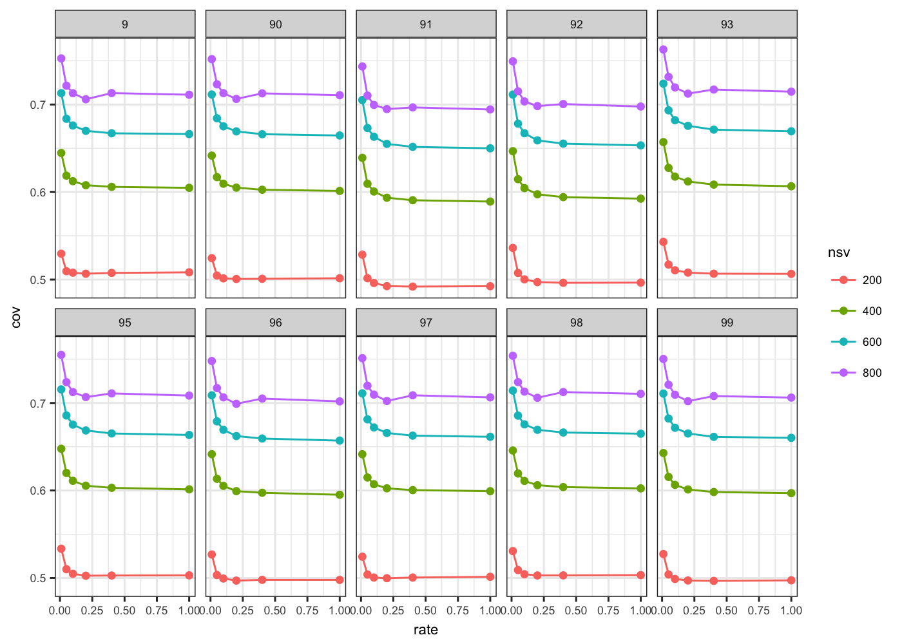
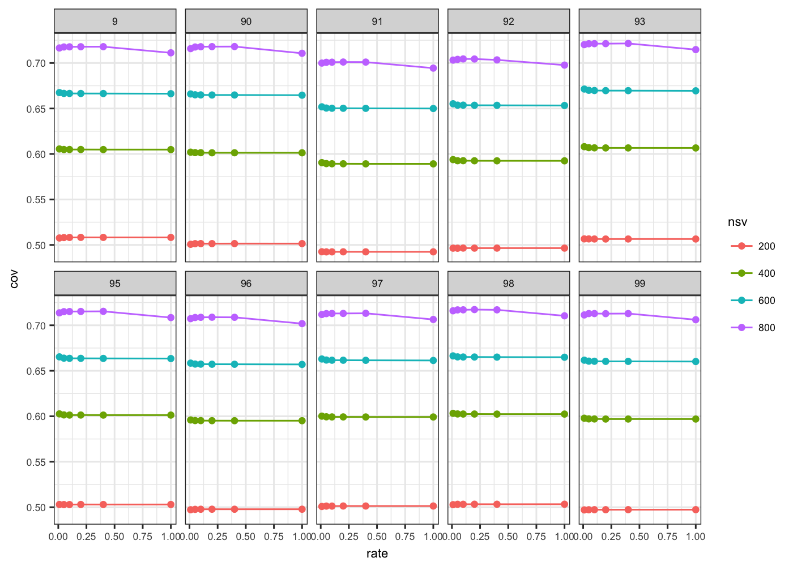
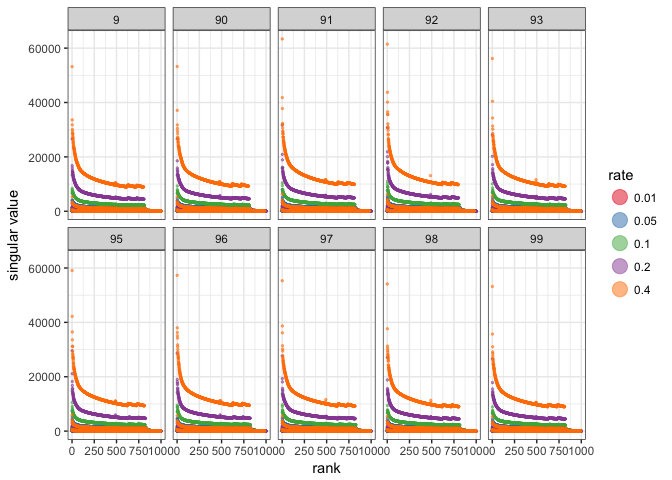
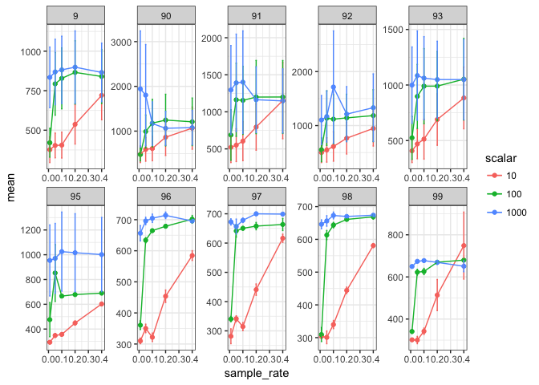

Matrix sampling for TFIDF
================
Santina Lin
November 9, 2016

Overview
--------

Looking at how sampling rate affect the variances of the matrix.

The idea is that, the same number of singular values produce the same variance in a sampled matrix as the one in the original non-sampled matrix.

In this experiment, we first convert the original term-frequency into TFIDF (term-frequency-inverse-document-frequency) and then multiply them by a factor (10, 100, 1000), sample at various rates (0.01, 0.05, 0.1, 0.2, 0.4) with three replicates \[1-3\]. Since there are 10 different original matrices, that's a total of 450 sampled matrices.

We then do SVD on each of the matrices (nsv = 800) and see how the coverage (ratio of total variance for a given NSV to the forbenius norm of the original matrix)

Data
----

Setting up the required packages and import the data

``` r
library(ggplot2)
library(plyr) # note to self: load this before dplyr always. 
library(dplyr)
library(magrittr)
```

Get the data

``` r
tfidf <- read.table("TFIDF.result", header=TRUE)
tfidf_original <- read.table("tfidf_original.summary", header=TRUE)
```

Inspect data

``` r
str(tfidf)
```

    ## 'data.frame':    1800 obs. of  5 variables:
    ##  $ matrix_name     : Factor w/ 450 levels "9.tfidf_10_0.01_1",..: 148 148 148 148 150 150 150 150 149 149 ...
    ##  $ forbenius       : num  31268205 31268205 31268205 31268205 31203386 ...
    ##  $ maxAcceptableNSV: int  213 213 213 213 215 215 215 215 207 207 ...
    ##  $ variance        : num  7691816 11024922 13408814 15319359 7694528 ...
    ##  $ nsv             : int  200 400 600 800 200 400 600 800 200 400 ...

``` r
str(tfidf_original)
```

    ## 'data.frame':    40 obs. of  5 variables:
    ##  $ matrix_name     : Factor w/ 10 levels "9.tfidf","90.tfidf",..: 1 1 1 1 10 10 10 10 7 7 ...
    ##  $ forbenius       : num  1489177 1489177 1489177 1489177 1500227 ...
    ##  $ maxAcceptableNSV: int  709 709 709 709 718 718 718 718 715 715 ...
    ##  $ variance        : num  384694 544726 661040 753233 371051 ...
    ##  $ nsv             : int  200 400 600 800 200 400 600 800 200 400 ...

Fixing my original calculation
------------------------------

On Dec 20, I found that I forgot to take the square root of my frobenius norm and variance (sum of squares). Therefore, I'm doing it now to fix it with in the dataset itself to avoid having to rerun the command.

``` r
tfidf <- transform(tfidf, forbenius=sqrt(forbenius), variance=sqrt(variance))
tfidf_original <- transform(tfidf_original, forbenius=sqrt(forbenius), variance=sqrt(variance))
```

Cleaning up the data to extract out information in the names

``` r
# Let's separate out the replication and rate  in different columns 
tfidf <- tfidf %>% tidyr::separate(matrix_name, c("matrix_name", "scalar", "rate", "replicate"), sep = "_") %>% readr::type_convert()
# Fix column name of tfidf and do the same thing 
tfidf$matrix_name <- as.factor(gsub(".tfidf", "", tfidf$matrix_name))
tfidf$nsv <- as.factor(tfidf$nsv)

# Fix tfidf_original to prepare for a rbind
tfidf_original$replicate = 1
tfidf_original$rate = 1
tfidf_original$scalar = 1
tfidf_original$matrix_name <- as.factor(gsub(".tfidf", "", tfidf_original$matrix_name))
tfidf_original$nsv <- as.factor(tfidf_original$nsv)


# rbind and set factors as necessary
all <- rbind(tfidf, tfidf_original)
all$scalar <- as.factor(all$scalar)
```

Calculate coverage
------------------

``` r
get_summary <- function(data) {
  summary <- data %>% dplyr::group_by(matrix_name, rate, nsv, scalar) %>% dplyr::summarise_at(c("variance", "forbenius"), c("mean", "sd")) %>% dplyr::mutate(cov = variance_mean / forbenius_mean)
}
tfidf_summary <- get_summary(all)
```

Result
------

``` r
# Plot tfidf 
ggplot(tfidf_summary, aes(x = rate, y = cov, colour = nsv, group = nsv)) + geom_point() + facet_wrap(~matrix_name) + theme_bw()
```


See the difference in scalar
----------------------------

Scalar = 10

``` r
# Create different data.frame for different scalar group (including the sample = 1 group)
all_10 <- rbind(tfidf_original, tfidf[tfidf$scalar==10,])
all_10 <- get_summary(all_10)
ggplot(all_10, aes(x = rate, y = cov, colour = nsv, group = nsv)) + geom_point() + geom_line() +  facet_wrap(~matrix_name, nrow=2) + theme_bw()
```



Scalar = 100

``` r
all_100 <- rbind(tfidf_original, tfidf[tfidf$scalar==100,])
all_100 <- get_summary(all_100)
ggplot(all_100, aes(x = rate, y = cov, colour = nsv, group = nsv)) + geom_point() + geom_line() +  facet_wrap(~matrix_name, nrow=2) + theme_bw() 
```


Scalar = 1000

``` r
all_1000 <- rbind(tfidf_original, tfidf[tfidf$scalar==1000,])
all_1000 <- get_summary(all_1000)
ggplot(all_1000, aes(x = rate, y = cov, colour = nsv, group = nsv)) + geom_point() + geom_line() +  facet_wrap(~matrix_name, nrow=2) + theme_bw() 
```



Look at error estimates and singular values
-------------------------------------------

``` r
# Data process. Loading from my own project space because I don't want to commit the result file. 
svals_tfidf <- read.table("/projects/slin_prj/PubMed_Experiment/graph_sparsification/svals_sampled_tfidf.result", header=TRUE)
svals_tfidf <- svals_tfidf %>% dplyr::group_by(matrix_name, rate, multiplier, rank) %>% dplyr::summarise_at(c("singular_value", "error_estimate"), c("mean", "sd"))
svals_tfidf <- svals_tfidf %>% tidyr::separate(matrix_name, c("id"), sep = "[.]") # simplify matrix name 
svals_tfidf$rate <- factor(svals_tfidf$rate)
```

For multiplier = 10

``` r
# Excluding 93 to see the others better. 
ggplot(svals_tfidf[c(svals_tfidf$id != "93", svals_tfidf$multiplier==10), ], aes(x=rank, y=error_estimate_mean, colour=rate)) + geom_point(alpha=0.5, size=0.5) + facet_wrap(~id) + scale_color_brewer(palette="Spectral") + ylab("singular values") + theme_bw()
```

    ## Warning: Removed 49901 rows containing missing values (geom_point).

 From the look of it, the error estimate are similar for matrices sampled at different rate. Powergraph's error of singular value estimates are similar for the same matrix sampled at different rate.

A look at the singular values

``` r
ggplot(svals_tfidf, aes(x=rank, y=singular_value_mean, colour=rate)) + geom_point(alpha=0.5, size=0.5) + facet_wrap(~id, nrow=2) + scale_color_brewer(palette="Spectral") + ylab("singular value") + theme_bw()
```



``` r
# Exclude 93 for 3 by 3 
ggplot(svals_tfidf[svals_tfidf$id != "93", ], aes(x=rank, y=singular_value_mean, colour=rate)) + geom_point(alpha=0.5, size=0.5) + facet_wrap(~id) + scale_color_brewer(palette="Spectral") + ylab("singular value") + theme_bw()
```


Running time
------------

Load data

``` r
run_time <- read.table("tfidf_runningtime.result", header=TRUE)
str(run_time)
```

    ## 'data.frame':    450 obs. of  4 variables:
    ##  $ matrix_name: int  90 90 90 90 90 90 90 90 90 90 ...
    ##  $ scalar     : int  1000 1000 1000 1000 1000 1000 100 1000 100 1000 ...
    ##  $ sample_rate: num  0.01 0.01 0.01 0.05 0.05 0.05 0.01 0.1 0.01 0.1 ...
    ##  $ run_time   : num  652 639 4536 679 663 ...

``` r
run_time$scalar <- factor(run_time$scalar)
run_time$matrix_name <- factor(run_time$matrix_name)
```

Summarize the data by taking the average

``` r
get_summary <- function(data) {
  summary <- data %>% dplyr::group_by(matrix_name, sample_rate, scalar) %>% dplyr::summarise_at(c("run_time"), c("mean", "sd")) %>% dplyr::mutate(de = sd/sqrt(3) )
}

run_time_summary <- get_summary(run_time)
head(run_time_summary)
```

    ## Source: local data frame [6 x 6]
    ## Groups: matrix_name, sample_rate [2]
    ## 
    ##   matrix_name sample_rate scalar     mean       sd        de
    ##        <fctr>       <dbl> <fctr>    <dbl>    <dbl>     <dbl>
    ## 1           9        0.01     10 376.5380 140.9339  81.36824
    ## 2           9        0.01    100 420.6820 158.4750  91.49557
    ## 3           9        0.01   1000 834.1340 332.7937 192.13852
    ## 4           9        0.05     10 403.5013 135.7248  78.36076
    ## 5           9        0.05    100 793.2150 343.8925 198.54642
    ## 6           9        0.05   1000 868.5517 358.8197 207.16467

Graph result

``` r
ggplot(run_time_summary, aes(x = sample_rate, y = mean, colour = scalar, group = scalar)) + geom_point() + geom_line() + geom_errorbar(aes(ymax = mean + de, ymin=mean - de), width=0.01) +  facet_wrap(~matrix_name, nrow=2) + theme_bw()
```



Remove 90, 91, and 92 to show the data better.

``` r
run_time_summary_subset <- subset(run_time_summary, !matrix_name %in% c("90", "91", "92"))
ggplot(run_time_summary_subset, aes(x = sample_rate, y = mean, colour = scalar, group = scalar)) + geom_point() + geom_line() + geom_errorbar(aes(ymax = mean + de, ymin=mean - de), width=0.01) +  facet_wrap(~matrix_name) + theme_bw()
```


Sparsity
--------

Load data

``` r
sparsity <- read.table("sparsity_TFIDF.result", header=TRUE)
str(sparsity)
```

    ## 'data.frame':    450 obs. of  4 variables:
    ##  $ matrix_name: int  90 90 90 90 90 90 90 90 90 90 ...
    ##  $ scalar     : int  1000 1000 1000 1000 1000 1000 100 1000 100 1000 ...
    ##  $ sample_rate: num  0.01 0.01 0.01 0.05 0.05 0.05 0.01 0.1 0.01 0.1 ...
    ##  $ n_entries  : int  230218 230215 230215 230223 230223 230223 197416 230223 197552 230223 ...

``` r
sparsity$scalar <- factor(sparsity$scalar)
sparsity$matrix_name <- factor(sparsity$matrix_name)
```

Summarize the data by taking the average

``` r
get_summary <- function(data) {
  summary <- data %>% dplyr::group_by(matrix_name, sample_rate, scalar) %>% dplyr::summarise_at(c("n_entries"), c("mean", "sd")) %>% dplyr::mutate(de = sd/sqrt(3) )
}

sparsity_summary <- get_summary(sparsity)
head(sparsity_summary)
```

    ## Source: local data frame [6 x 6]
    ## Groups: matrix_name, sample_rate [2]
    ## 
    ##   matrix_name sample_rate scalar      mean         sd        de
    ##        <fctr>       <dbl> <fctr>     <dbl>      <dbl>     <dbl>
    ## 1           9        0.01     10  45516.33  99.771405  57.60305
    ## 2           9        0.01    100 189102.33 274.403596 158.42699
    ## 3           9        0.01   1000 221068.67   2.081666   1.20185
    ## 4           9        0.05     10 145851.33 173.808324 100.34828
    ## 5           9        0.05    100 220812.00  18.357560  10.59874
    ## 6           9        0.05   1000 221073.00   0.000000   0.00000

Graph result

``` r
ggplot(sparsity_summary, aes(x = sample_rate, y = mean, colour = scalar, group = scalar)) + geom_point() + geom_line() + geom_errorbar(aes(ymax = mean + de, ymin=mean - de), width=0.01) +  facet_wrap(~matrix_name, nrow=2) + theme_bw()
```


Make 3 by 3

``` r
ggplot(sparsity_summary[sparsity_summary$matrix_name!="9", ], aes(x = sample_rate, y = mean, colour = scalar, group = scalar)) + geom_point() + geom_line() + geom_errorbar(aes(ymax = mean + de, ymin=mean - de), width=0.01) +  facet_wrap(~matrix_name) + theme_bw()
```


