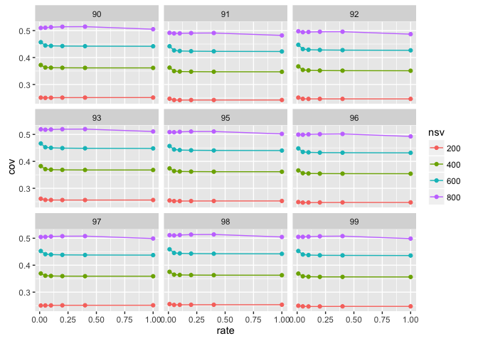

# Matrix sampling for TFIDF
Santina Lin  
November 9, 2016  

## Overview 
Looking at how sampling rate affect the variances of the matrix. 

The idea is that, the same number of singular values produce the same variance in a sampled matrix as the one in the original non-sampled matrix. 

In this experiment, we first convert the original term-frequency into TFIDF (term-frequency-inverse-document-frequency) and then multiply them by a factor (10, 100, 1000), sample at various rates (0.01, 0.05, 0.1, 0.2, 0.4) with three replicates [1-3]. Since there are 10 different original matrices, that's a total of 450 sampled matrices. 

We then do SVD on each of the matrices (nsv = 800) and see how the coverage (ratio of total variance for a given NSV to the forbenius norm of the original matrix)

## Data
Setting up the required packages and import the data 

```r
library(ggplot2)
library(plyr) # note to self: load this before dplyr always. 
library(dplyr)
```

```
## Warning: package 'dplyr' was built under R version 3.2.5
```

```r
library(magrittr)
```
Get the data

```r
tfidf <- read.table("TFIDF.result", header=TRUE)
tfidf_original <- read.table("tfidf_original.summary", header=TRUE)
```
Inspect data 

```r
str(tfidf)
```

```
## 'data.frame':	1800 obs. of  5 variables:
##  $ matrix_name     : Factor w/ 450 levels "9.tfidf_10_0.01_1",..: 148 148 148 148 150 150 150 150 149 149 ...
##  $ forbenius       : num  31268205 31268205 31268205 31268205 31203386 ...
##  $ maxAcceptableNSV: int  213 213 213 213 215 215 215 215 207 207 ...
##  $ variance        : num  7691816 11024922 13408814 15319359 7694528 ...
##  $ nsv             : int  200 400 600 800 200 400 600 800 200 400 ...
```

```r
str(tfidf_original)
```

```
## 'data.frame':	40 obs. of  5 variables:
##  $ matrix_name     : Factor w/ 10 levels "9.tfidf","90.tfidf",..: 1 1 1 1 10 10 10 10 7 7 ...
##  $ forbenius       : num  1489177 1489177 1489177 1489177 1500227 ...
##  $ maxAcceptableNSV: int  709 709 709 709 718 718 718 718 715 715 ...
##  $ variance        : num  384694 544726 661040 753233 371051 ...
##  $ nsv             : int  200 400 600 800 200 400 600 800 200 400 ...
```

Cleaning up the data to extract out information in the names

```r
# Let's separate out the replication and rate  in different columns 
tfidf <- tfidf %>% tidyr::separate(matrix_name, c("matrix_name", "scalar", "rate", "replicate"), sep = "_") %>% readr::type_convert()
# Fix column name of tfidf and do the same thing 
tfidf$matrix_name <- as.factor(gsub(".tfidf", "", tfidf$matrix_name))
tfidf$nsv <- as.factor(tfidf$nsv)

# Fix tfidf_original to prepare for a rbind
tfidf_original$replicate = 1
tfidf_original$rate = 1
tfidf_original$scalar = 1
tfidf_original$matrix_name <- as.factor(gsub(".tfidf", "", tfidf_original$matrix_name))
tfidf_original$nsv <- as.factor(tfidf_original$nsv)


# rbind and set factors as necessary
all <- rbind(tfidf, tfidf_original)
all$scalar <- as.factor(all$scalar)
```

## Calculate coverage 


```r
get_summary <- function(data) {
  tfidf_summary <- data %>% dplyr::group_by(matrix_name, rate, nsv, scalar) %>% dplyr::summarise_at(c("variance", "forbenius"), c("mean", "sd")) %>% dplyr::mutate(cov = variance_mean / forbenius_mean)
}

tfidf_summary <- get_summary(all)
```


## Result 

```r
# Plot tfidf 
ggplot(tfidf_summary, aes(x = rate, y = cov, colour = nsv, group = nsv)) + geom_point() + facet_wrap(~matrix_name)
```

\

## See the difference in scalar

First let me remove matrix 9 so that the facet_wrap can be 3 by 3. 

```r
tfidf_original <- tfidf_original[tfidf_original$matrix_name != "9",]
tfidf <- tfidf[tfidf$matrix_name != "9",]
```


Scalar = 10

```r
# Create different data.frame for different scalar group (including the sample = 1 group)
all_10 <- rbind(tfidf_original, tfidf[tfidf$scalar==10,])
all_10 <- get_summary(all_10)
ggplot(all_10, aes(x = rate, y = cov, colour = nsv, group = nsv)) + geom_point() + geom_line() +  facet_wrap(~matrix_name)
```

\

Scalar = 100

```r
all_100 <- rbind(tfidf_original, tfidf[tfidf$scalar==100,])
all_100 <- get_summary(all_100)
ggplot(all_100, aes(x = rate, y = cov, colour = nsv, group = nsv)) + geom_point() + geom_line() +  facet_wrap(~matrix_name)
```

\

Scalar = 1000

```r
all_1000 <- rbind(tfidf_original, tfidf[tfidf$scalar==1000,])
all_1000 <- get_summary(all_1000)
ggplot(all_1000, aes(x = rate, y = cov, colour = nsv, group = nsv)) + geom_point() + geom_line() +  facet_wrap(~matrix_name)
```

\


