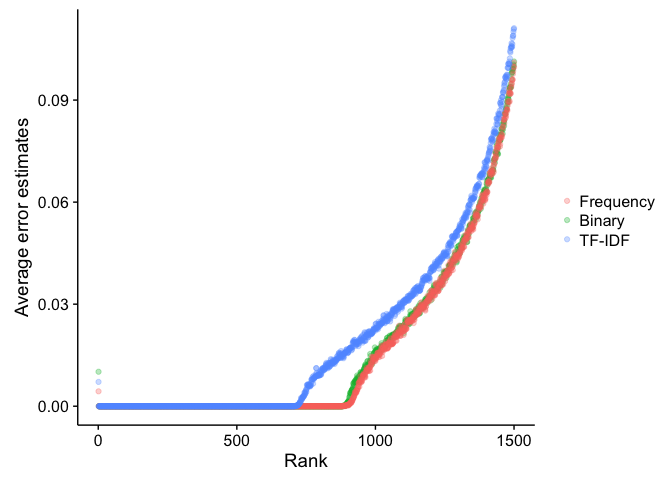
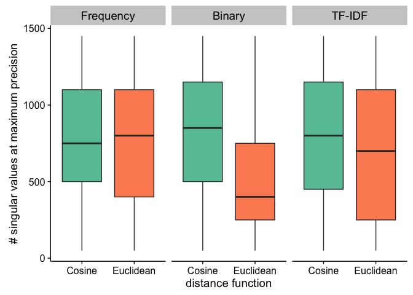

# Multiple instances considering top 10
Santina Lin  
November 14, 2016  

(this is copied pasted from "../multiple_instances/result_muliple.Rmd". The only difference is that the data source is swapped out. The graphs from this one are the ones to go into the thesis)

This shows the result of 92 repeats of small matrices experiment. The purpose is to test the precision, using PubMed as ground truth, when we use different parameters. 

# Data preparation and inspection


```r
library(ggplot2)
library(cowplot)
library(plyr)
library(dplyr)
library(knitr) # kable()
library(tidyr)
```

First load the data for top10 precision. 

```r
# A function to prepare the data 
prepare_data <- function(filepath){
  data <- read.table(filepath)  # read in the file 
  colnames(data) <- c("ExperimentNum", "distFunc", "nsv", "precision", "seconds") # Set the column name 
  data$ExperimentNum <- as.factor(data$ExperimentNum) # Make sure experiment numbers are factors
  data 
}

term_frequency <- prepare_data("data/term_freq_precision_top10.result") 
term_binary <- prepare_data("data/term_binary_precision_top10.result")
tf_idf <- prepare_data("data/tfidf_precision_top10.result")
```

Slight inspection of the data 

```r
str(tf_idf)
```

```
## 'data.frame':	5336 obs. of  5 variables:
##  $ ExperimentNum: Factor w/ 92 levels "1","2","3","4",..: 10 10 10 10 10 10 10 10 10 10 ...
##  $ distFunc     : Factor w/ 2 levels "Cosine","Euclidean": 2 1 2 1 2 1 2 1 2 1 ...
##  $ nsv          : int  50 50 100 100 150 150 200 200 250 250 ...
##  $ precision    : num  0.88 0.898 0.916 0.944 0.912 ...
##  $ seconds      : num  48.57 6.97 49.93 7.21 52.54 ...
```

```r
unique(tf_idf$nsv)  # see what are the numbers of singular values that I measured 
```

```
##  [1]   50  100  150  200  250  300  350  400  450  500  550  600  650  700
## [15]  750  800  850  900  950 1000 1050 1100 1150 1200 1250 1300 1350 1400
## [29] 1450
```

As we can see that there are 5336 observations. That's because we have two different distance metrics, 29 different numbers of singular values, and all these are repeated over 92 experiments. This is the same for all three dataset. Each is for a different input matrix into Graphlab. 

Lastly, we'll combine all three dataframes 


```r
tf_idf$matrixType <- factor("TF-IDF")
term_binary$matrixType <- factor("Binary")
term_frequency$matrixType <- factor("Frequency")
all_result <- rbind(term_frequency, term_binary, tf_idf)
str(all_result) # inspect final dataframe
```

```
## 'data.frame':	16008 obs. of  6 variables:
##  $ ExperimentNum: Factor w/ 92 levels "1","2","3","4",..: 10 10 10 10 10 10 10 10 10 10 ...
##  $ distFunc     : Factor w/ 2 levels "Cosine","Euclidean": 2 1 2 1 2 1 2 1 2 1 ...
##  $ nsv          : int  50 50 100 100 150 150 200 200 250 250 ...
##  $ precision    : num  0.596 0.632 0.695 0.745 0.729 ...
##  $ seconds      : num  46.62 6.21 47.71 6.35 50.34 ...
##  $ matrixType   : Factor w/ 3 levels "Frequency","Binary",..: 1 1 1 1 1 1 1 1 1 1 ...
```

# Average precision curves 

The lines are the means of precisions from 92 different experiments for a given singular values. We can see that the performance is fairly consistent across any randomly chosen 100 PMIDs. 


```r
require(cowplot)
create_curves <- function(data, graphTitle){
  ggplot(data, aes(x=nsv, y=precision, colour=distFunc)) + geom_point(alpha=0.1) + 
  facet_grid(matrixType ~ .) +  ggtitle(graphTitle) + scale_x_continuous(expand = c(0, 0), breaks=seq(0, 1500, by=200)) +
  labs(x="# singular values",y="Average precision") +
  theme(legend.title=element_blank())+ 
  stat_summary(fun.y = mean, geom="line", size=1.0) + scale_colour_brewer(palette="Set2")
}
create_curves(all_result, "Average precisions in retrieving related PubMed articles")
```

<!-- -->

To see the average maxima for each combinations of parameters: 

```r
# Calculate mean precisions  
all_result_means <- ddply(all_result, c("distFunc", "matrixType", "nsv"), summarise,
      precision = mean(precision), meanTime = mean(seconds))

maxima <- aggregate(precision ~ matrixType + distFunc, max, data=all_result_means)  # see maximum of all combinations 
maxima <- merge(maxima, all_result_means[, c("matrixType", "nsv", "precision")], by=c("matrixType", "precision")) # bring in the number of nsv 
maxima <- arrange(maxima, matrixType, distFunc)[, c(1,3,4,2)] # arrange the dataframe
kable(maxima, format="markdown") # ensure Github can render the table
```


|matrixType |distFunc  |  nsv| precision|
|:----------|:---------|----:|---------:|
|Frequency  |Cosine    | 1150| 0.8481930|
|Frequency  |Euclidean |  400| 0.7449516|
|Binary     |Cosine    | 1300| 0.8719828|
|Binary     |Euclidean |  300| 0.6278501|
|TF-IDF     |Cosine    | 1400| 0.9488416|
|TF-IDF     |Euclidean |  100| 0.9044853|

As demosntrated in the code: I first take the mean of precisions across all samples, for each unique combination of sample number, nsv, distance function, and matrix type. So basically an average for 92 different points. Then I get the maxima prececisions across all number of singular values for each unique combination of distance function and matrixtype. That way we know, on average, at what nsv are the maxima precision is achieved. 

# Frobenius norm 

It's good to see how much the data is captured at different nsv. This would give an idea of how much information we actually need to make prediction. 
We want to see how much coverage we are achieving. 

```r
tfidf_coverage  <- read.table("data/tf_idf_frobenius.result", header=TRUE)
term_freq_coverage <- read.table("data/term_freq_frobenius.result", header=TRUE)
term_binary_coverage <- read.table("data/term_binary_frobenius.result", header=TRUE)
tfidf_coverage$matrixType = factor("TF-IDF")
term_freq_coverage$matrixType = factor("Frequency")
term_binary_coverage$matrixType = factor("Binary")
coverage <- rbind(term_freq_coverage, term_binary_coverage, tfidf_coverage)
coverage <- dplyr::mutate(coverage, cov = frobenius/matrix_norm)

# Graph
create_curves <- function(data){
  ggplot(data, aes(x=nsv, y=cov, colour=matrixType)) + geom_point(alpha=0.1) +
  scale_x_continuous(expand = c(0, 0), breaks=seq(0, 1500, by=200)) + 
  labs(x="# singular values",y="Average coverage") + 
  theme(plot.title = element_text(color="#666666", face="bold", size=16, hjust=0.2, vjust=1),legend.title=element_blank()) + 
  stat_summary(fun.y = mean, geom="line", size=1.0)
}
create_curves(coverage)
```

<!-- -->

# Singular value and error estimate 

```r
sVals  <- read.table("data/singular_value_summary.result", header=TRUE)
sVals  <-  ddply(sVals, c("matrix_type", "rank"), summarise, avg_sval = mean(singular_value), avg_error = mean(error_estimate), std_sval = sd(singular_value), std_error = sd(error_estimate))

# Rearrange and rename factors to match the first graph.
sVals$matrix_type <- factor(sVals$matrix_type, levels=c("term_freq", "term_binary", "tf_idf"), labels=c("Frequency", "Binary", "TF-IDF"))

# Plot singular value by rank plot
ggplot(data=sVals, aes(x = rank, y=avg_sval, colour=matrix_type)) + geom_point(alpha=0.3) + labs(x="Rank",y="Average singular value")  + theme(legend.title=element_blank()) 
```

<!-- -->

```r
# Plot error by rank 
ggplot(data=sVals, aes(x = rank, y=avg_error, colour=matrix_type)) + geom_point(alpha=0.3) + labs(x="Rank",y="Average error estimates")  + theme(legend.title=element_blank())
```

<!-- -->

I don't know how to explain both the superior of TFIDF but its lower coverage than the other two metrics. Perhaps with TF-IDF the first ranks captured by SVD are more accurate. 

# Distribution of max precision 

Here we take the maxima precision across all number of singular values in each sample. So we should have 92 maxima points for each combination of distance function and matrix type. 


```r
max_mean <- aggregate(precision ~ matrixType + ExperimentNum + distFunc, max, data=all_result)  # see maximum of all combinations 
ggplot(max_mean, aes(x=distFunc, y=precision, fill=distFunc)) + geom_boxplot(show.legend = FALSE) + 
  facet_wrap(~matrixType) + labs(y="maximum precisions",x="distance function") + 
  theme(legend.title = element_text(size=14), 
        legend.text = element_text(size=14),
        axis.text = element_text(size=12), 
        axis.title = element_text(size=14), 
        strip.text.x = element_text(size=14)) + scale_fill_brewer(palette="Set2") 
```

<!-- -->


```r
# Get standard deviation 
max_mean_sd <- ddply(max_mean, c("matrixType", "distFunc"), summarise,
      avg_max_precision = mean(precision), sd = sd(precision))
kable(max_mean_sd, format="markdown") # ensure Github can render the table
```


|matrixType |distFunc  | avg_max_precision|        sd|
|:----------|:---------|-----------------:|---------:|
|Frequency  |Cosine    |         0.8517526| 0.0241156|
|Frequency  |Euclidean |         0.7514892| 0.0312614|
|Binary     |Cosine    |         0.8741209| 0.0205064|
|Binary     |Euclidean |         0.6321046| 0.0324885|
|TF-IDF     |Cosine    |         0.9540638| 0.0134976|
|TF-IDF     |Euclidean |         0.9067123| 0.0224186|

# Distribution of nsv at maxima precision 

Here we take the nsv at which maxima precision occcurs across all number of singular values in each sample. So we should have 92 nsv points for each combination of distance function and matrix type. 


```r
maxima_nsv <- merge(max_mean, all_result[, c("precision", "nsv")], by="precision") # bring in the number of nsv 
ggplot(maxima_nsv, aes(x=distFunc, y=nsv, fill=distFunc)) + geom_boxplot(show.legend = FALSE) + 
  facet_wrap(~matrixType) + labs(y="# singular values at maximum precision",x="distance function")+ 
  theme(legend.title = element_text(size=14), 
        legend.text = element_text(size=14),
        axis.text = element_text(size=12), 
        axis.title = element_text(size=14), 
        strip.text.x = element_text(size=14)) + scale_fill_brewer(palette="Set2")
```

<!-- -->


```r
max_nsv_sd <- ddply(maxima_nsv, c("matrixType", "distFunc"), summarise,
      avg_max_nsv = mean(nsv), sd = sd(nsv))
kable(max_nsv_sd, format="markdown") # ensure Github can render the table
```


|matrixType |distFunc  | avg_max_nsv|       sd|
|:----------|:---------|-----------:|--------:|
|Frequency  |Cosine    |    791.6722| 380.5501|
|Frequency  |Euclidean |    756.7708| 402.7234|
|Binary     |Cosine    |    820.6219| 404.4732|
|Binary     |Euclidean |    534.4482| 395.5325|
|TF-IDF     |Cosine    |    787.3079| 405.8333|
|TF-IDF     |Euclidean |    701.4610| 446.7085|

# Running time

This is to see how long the calculation takes. So it looks like using cosine function is not only more accurate but also takes less time. 


```r
ggplot(all_result_means, aes(x=nsv, y=meanTime, colour=distFunc)) + geom_point() + facet_grid(matrixType ~ .) + 
  labs(x="number of singular values", y="average time")  + scale_colour_brewer(palette="Set2") + theme(legend.title=element_blank())
```

<!-- -->

