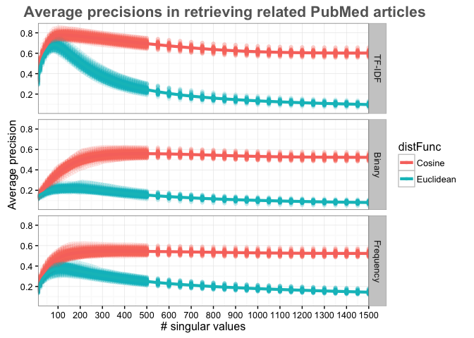
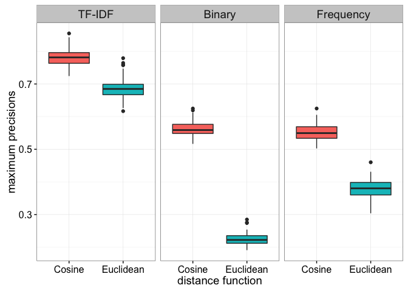
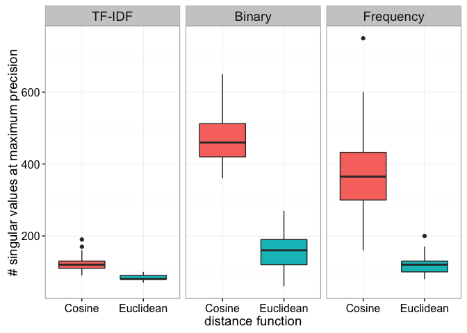
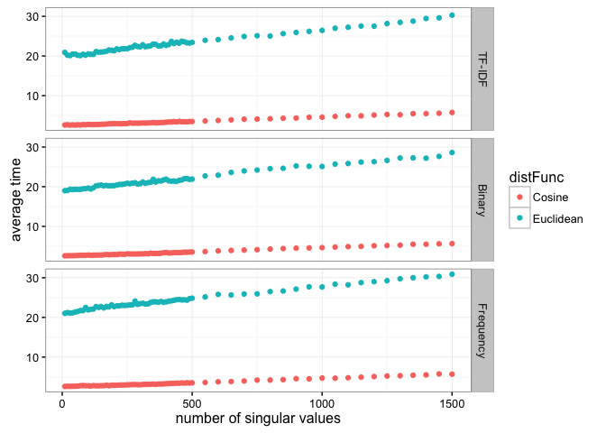

# Evaluation: multiple instances of PubMed Experiments
Santina Lin  
January 29, 2016  

This shows the result of 92 repeats of [this experiment](result.md). 
The data are split by the type of matrices in order to decrease the time of processing 

# Data preparation and inspection


```r
library(ggplot2)
library(plyr)
library(dplyr)
```

```
## 
## Attaching package: 'dplyr'
```

```
## The following objects are masked from 'package:plyr':
## 
##     arrange, count, desc, failwith, id, mutate, rename, summarise,
##     summarize
```

```
## The following objects are masked from 'package:stats':
## 
##     filter, lag
```

```
## The following objects are masked from 'package:base':
## 
##     intersect, setdiff, setequal, union
```

```r
library(knitr) # kable()
```
First load the data 

```r
# A function to prepare the data 
prepare_data <- function(filepath){
  data <- read.table(filepath)  # read in the file 
  colnames(data) <- c("ExperimentNum", "distFunc", "nsv", "precision", "seconds") # Set the column name 
  data$ExperimentNum <- as.factor(data$ExperimentNum) # Make sure experiment numbers are factors
  data 
}

term_frequency <- prepare_data("../multiple_instances/term_freq.gphost03.result") 
term_binary <- prepare_data("../multiple_instances/term_binary.gphost03.result")
tf_idf <- prepare_data("../multiple_instances/tf_idf.gphost03.result")
```

Slight inspection of the data 

```r
str(tf_idf)
```

```
## 'data.frame':	12880 obs. of  5 variables:
##  $ ExperimentNum: Factor w/ 92 levels "1","2","3","4",..: 10 10 10 10 10 10 10 10 10 10 ...
##  $ distFunc     : Factor w/ 2 levels "Cosine","Euclidean": 2 1 2 1 2 1 2 1 2 1 ...
##  $ nsv          : int  10 10 20 20 30 30 40 40 50 50 ...
##  $ precision    : num  0.327 0.367 0.485 0.525 0.559 ...
##  $ seconds      : num  22.65 3.02 22.79 3.03 22.83 ...
```

```r
str(term_binary)
```

```
## 'data.frame':	12880 obs. of  5 variables:
##  $ ExperimentNum: Factor w/ 92 levels "1","2","3","4",..: 10 10 10 10 10 10 10 10 10 10 ...
##  $ distFunc     : Factor w/ 2 levels "Cosine","Euclidean": 2 1 2 1 2 1 2 1 2 1 ...
##  $ nsv          : int  10 10 20 20 30 30 40 40 50 50 ...
##  $ precision    : num  0.161 0.171 0.188 0.208 0.196 ...
##  $ seconds      : num  20.68 2.88 20.4 2.78 20.39 ...
```

```r
str(term_frequency)
```

```
## 'data.frame':	12880 obs. of  5 variables:
##  $ ExperimentNum: Factor w/ 92 levels "1","2","3","4",..: 10 10 10 10 10 10 10 10 10 10 ...
##  $ distFunc     : Factor w/ 2 levels "Cosine","Euclidean": 2 1 2 1 2 1 2 1 2 1 ...
##  $ nsv          : int  10 10 20 20 30 30 40 40 50 50 ...
##  $ precision    : num  0.194 0.221 0.27 0.295 0.298 ...
##  $ seconds      : num  25 2.92 25.51 2.96 24.77 ...
```

```r
unique(tf_idf$nsv)  # see what are the numbers of singular values that I measured 
```

```
##  [1]   10   20   30   40   50   60   70   80   90  100  110  120  130  140
## [15]  150  160  170  180  190  200  210  220  230  240  250  260  270  280
## [29]  290  300  310  320  330  340  350  360  370  380  390  400  410  420
## [43]  430  440  450  460  470  480  490  500  550  600  650  700  750  800
## [57]  850  900  950 1000 1050 1100 1150 1200 1250 1300 1350 1400 1450 1500
```

As we can see that there are 12880 observations. That's because we have two different distance metrics, 70 different numbers of singular values, and all these are repeated over 92 experiments. This is the same for all three dataset. Each is for a different input matrix into Graphlab. 

Lastly, we'll combine all three dataframes 


```r
tf_idf$matrixType <- factor("TF-IDF")
term_binary$matrixType <- factor("Binary")
term_frequency$matrixType <- factor("Frequency")
all_result <- rbind(tf_idf, term_binary, term_frequency)
str(all_result) # inspect final dataframe
```

```
## 'data.frame':	38640 obs. of  6 variables:
##  $ ExperimentNum: Factor w/ 92 levels "1","2","3","4",..: 10 10 10 10 10 10 10 10 10 10 ...
##  $ distFunc     : Factor w/ 2 levels "Cosine","Euclidean": 2 1 2 1 2 1 2 1 2 1 ...
##  $ nsv          : int  10 10 20 20 30 30 40 40 50 50 ...
##  $ precision    : num  0.327 0.367 0.485 0.525 0.559 ...
##  $ seconds      : num  22.65 3.02 22.79 3.03 22.83 ...
##  $ matrixType   : Factor w/ 3 levels "TF-IDF","Binary",..: 1 1 1 1 1 1 1 1 1 1 ...
```


# Average recalls curves 

The lines are the means of precisions from 92 different experiments for a given singular values. We can see that the performance is fairly consistent across any randomly chosen 100 PMIDs. 


```r
create_curves <- function(data, graphTitle){
  ggplot(data, aes(x=nsv, y=precision, colour=distFunc)) + geom_point(alpha=0.1) + 
  facet_grid(matrixType ~ .) + theme_bw() + ggtitle(graphTitle) + scale_x_continuous(expand = c(0, 0), breaks=seq(0, 1500, by=100)) + 
  labs(x="# singular values",y="Average precision") +
  theme(plot.title = element_text(color="#666666", face="bold", size=16, hjust=0.2, vjust=1))+ 
  stat_summary(fun.y = mean, geom="line", size=1.5)
}
create_curves(all_result, "Average precisions in retrieving related PubMed articles")
```

\

To see the average maxima for each combinations of parameters: 

```r
# Calculate mean precisions  
all_result_means <- ddply(all_result, c("distFunc", "matrixType", "nsv"), summarise,
      precision = mean(precision), meanTime = mean(seconds))

maxima <- aggregate(precision ~ matrixType + distFunc, max, data=all_result_means)  # see maximum of all combinations 
maxima <- merge(maxima, all_result_means[, c("matrixType", "nsv", "precision")], by=c("matrixType", "precision")) # bring in the number of nsv 
maxima <- arrange(maxima, matrixType, distFunc)[, c(1,3,4,2)] # arrange the dataframe
kable(maxima, format="markdown") # ensure Github can render the table
```


|matrixType |distFunc  | nsv| precision|
|:----------|:---------|---:|---------:|
|TF-IDF     |Cosine    | 120| 0.7780318|
|TF-IDF     |Euclidean |  80| 0.6851910|
|Binary     |Cosine    | 490| 0.5588000|
|Binary     |Euclidean | 170| 0.2189714|
|Frequency  |Cosine    | 360| 0.5462449|
|Frequency  |Euclidean | 120| 0.3752115|

As demosntrated in the code: I first take the mean of precisions across all samples, for each unique combination of sample number, nsv, distance function, and matrix type. So basically an average for 92 different points. Then I get the maxima prececisions across all number of singular values for each unique combination of distance function and matrixtype. That way we know, on average, at what nsv are the maxima precision is achieved. 

# Distribution of max precision 

Here we take the maxima precision across all number of singular values in each sample. So we should have 92 maxima points for each combination of distance function and matrix type. 


```r
max_mean <- aggregate(precision ~ matrixType + ExperimentNum + distFunc, max, data=all_result)  # see maximum of all combinations 
ggplot(max_mean, aes(x=distFunc, y=precision, fill=distFunc)) + geom_boxplot(show.legend = FALSE) + 
  theme_bw() + facet_wrap(~matrixType) + labs(y="maximum precisions",x="distance function") + 
  theme(legend.title = element_text(size=14), 
        legend.text = element_text(size=14),
        axis.text = element_text(size=12), 
        axis.title = element_text(size=14), 
        strip.text.x = element_text(size=14))
```

\


```r
# Get standard deviation 
max_mean_sd <- ddply(max_mean, c("matrixType", "distFunc"), summarise,
      avg_max_precision = mean(precision), sd = sd(precision))
kable(max_mean_sd, format="markdown") # ensure Github can render the table
```


|matrixType |distFunc  | avg_max_precision|        sd|
|:----------|:---------|-----------------:|---------:|
|TF-IDF     |Cosine    |         0.7799117| 0.0254599|
|TF-IDF     |Euclidean |         0.6860384| 0.0314670|
|Binary     |Cosine    |         0.5616686| 0.0229279|
|Binary     |Euclidean |         0.2244479| 0.0184671|
|Frequency  |Cosine    |         0.5509323| 0.0238564|
|Frequency  |Euclidean |         0.3790419| 0.0292192|

# Distribution of nsv at maxima precision 

Here we take the nsv at which maxima precision occcurs across all number of singular values in each sample. So we should have 92 nsv points for each combination of distance function and matrix type. 


```r
maxima_nsv <- merge(max_mean, all_result[, c("precision", "nsv")], by="precision") # bring in the number of nsv 
ggplot(maxima_nsv, aes(x=distFunc, y=nsv, fill=distFunc)) + geom_boxplot(show.legend = FALSE) + 
  theme_bw() + facet_wrap(~matrixType) + labs(y="# singular values at maximum precision",x="distance function")+ 
  theme(legend.title = element_text(size=14), 
        legend.text = element_text(size=14),
        axis.text = element_text(size=12), 
        axis.title = element_text(size=14), 
        strip.text.x = element_text(size=14))
```

\


```r
max_nsv_sd <- ddply(maxima_nsv, c("matrixType", "distFunc"), summarise,
      avg_max_nsv = mean(nsv), sd = sd(nsv))
kable(max_nsv_sd, format="markdown") # ensure Github can render the table
```


|matrixType |distFunc  | avg_max_nsv|         sd|
|:----------|:---------|-----------:|----------:|
|TF-IDF     |Cosine    |   120.97826|  18.220854|
|TF-IDF     |Euclidean |    83.15217|   6.099783|
|Binary     |Cosine    |   480.54348|  73.967087|
|Binary     |Euclidean |   153.80435|  46.806649|
|Frequency  |Cosine    |   371.95652| 105.478909|
|Frequency  |Euclidean |   116.52174|  22.455562|

# Running time

This is to see how long the calculation takes. So it looks like using cosine function is not only more accurate but also takes less time. 


```r
ggplot(all_result_means, aes(x=nsv, y=meanTime, colour=distFunc)) + geom_point() + facet_grid(matrixType ~ .) + 
  theme_bw() + labs(x="number of singular values", y="average time") 
```

\
