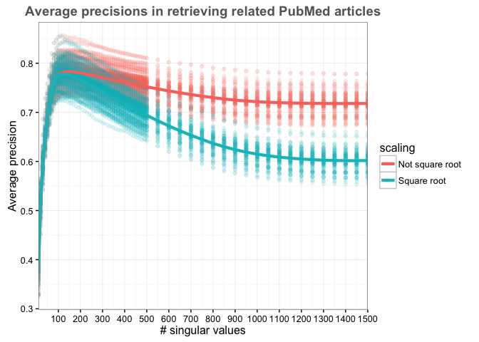
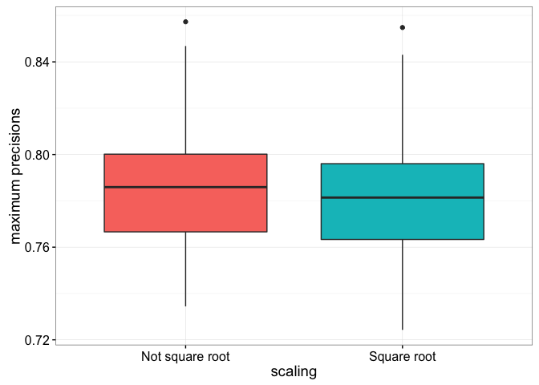
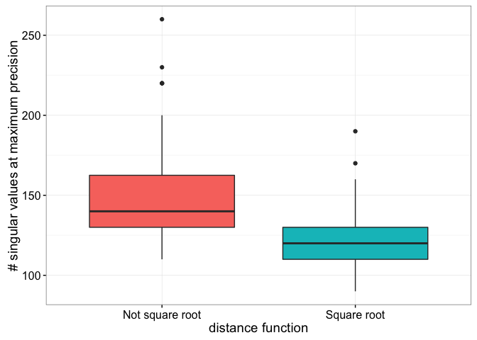

# Scaling the matrix
Santina Lin  
February 24, 2016  

This markdown is to look at how scaling the matrix with singular values or square root of singular values yield different precisions. 
So far I've been using square root. However, Sita said we should use singular values, with some hand waving. I don't understand the math enough to prove one or the other, so I'll use an experimental method to see which one is best fitting for finding relevant PubMed papers. 


```r
library(plyr)
library(dplyr)
library(ggplot2)
library(knitr)
```

## Load and Inspect the data

Since from the [previous experiment](result_multiple.md), we already know that cosine and tf-idf are the best. I only repeat the experiment using these two metrics on various number of singular values on matrix scaled by singular values. 


```r
prepare_data <- function(filepath){
  data <- read.table(filepath)  # read in the file 
  colnames(data) <- c("ExperimentNum", "distFunc", "nsv", "precision", "seconds") # Set the column name 
  data$ExperimentNum <- as.factor(data$ExperimentNum) # Make sure experiment numbers are factors
  data 
}

tf_idf <- prepare_data("../multiple_instances/tf_idf.gphost03.result")   # data from the other experiment in which matrices were scaled by square roots of singular values 
tf_idf_nonsqrt <- prepare_data("../multiple_instances/tf_idf_nonsqrtsv.hugin.result") # same procedure but this time the matrix was scaled by singular values 
tf_idf <- tf_idf[tf_idf$distFunc=="Cosine", ] # Keep only the ones using cosine function 

str(tf_idf)
```

```
## 'data.frame':	6440 obs. of  5 variables:
##  $ ExperimentNum: Factor w/ 92 levels "1","2","3","4",..: 10 10 10 10 10 10 10 10 10 10 ...
##  $ distFunc     : Factor w/ 2 levels "Cosine","Euclidean": 1 1 1 1 1 1 1 1 1 1 ...
##  $ nsv          : int  10 20 30 40 50 60 70 80 90 100 ...
##  $ precision    : num  0.367 0.525 0.602 0.649 0.686 ...
##  $ seconds      : num  3.02 3.03 3.04 3.08 3.07 ...
```

```r
str(tf_idf_nonsqrt)
```

```
## 'data.frame':	6440 obs. of  5 variables:
##  $ ExperimentNum: Factor w/ 92 levels "1","2","3","4",..: 10 10 10 10 10 10 10 10 10 10 ...
##  $ distFunc     : Factor w/ 1 level "Cosine": 1 1 1 1 1 1 1 1 1 1 ...
##  $ nsv          : int  10 20 30 40 50 60 70 80 90 100 ...
##  $ precision    : num  0.366 0.528 0.605 0.651 0.688 ...
##  $ seconds      : num  2.64 2.65 2.64 2.63 2.63 ...
```


Combine the two dataframe together 

```r
tf_idf$scaling <- factor("Square root")
tf_idf_nonsqrt$scaling <- factor("Not square root")
data <- rbind(tf_idf_nonsqrt, tf_idf)
str(data)
```

```
## 'data.frame':	12880 obs. of  6 variables:
##  $ ExperimentNum: Factor w/ 92 levels "1","2","3","4",..: 10 10 10 10 10 10 10 10 10 10 ...
##  $ distFunc     : Factor w/ 2 levels "Cosine","Euclidean": 1 1 1 1 1 1 1 1 1 1 ...
##  $ nsv          : int  10 20 30 40 50 60 70 80 90 100 ...
##  $ precision    : num  0.366 0.528 0.605 0.651 0.688 ...
##  $ seconds      : num  2.64 2.65 2.64 2.63 2.63 ...
##  $ scaling      : Factor w/ 2 levels "Not square root",..: 1 1 1 1 1 1 1 1 1 1 ...
```

## Graphing of all the precision (or recall )


```r
library(ggplot2)
create_curves <- function(data, graphTitle){
  ggplot(data, aes(x=nsv, y=precision, colour=scaling)) + geom_point(alpha=0.1) + 
  theme_bw() + ggtitle(graphTitle) + scale_x_continuous(expand = c(0, 0), breaks=seq(0, 1500, by=100)) + 
  labs(x="# singular values",y="Average precision") +
  theme(plot.title = element_text(color="#666666", face="bold", size=14, hjust=0.5, vjust=1))+ 
  stat_summary(fun.y = mean, geom="line", size=1.5)
}
create_curves(data, "Average precisions in retrieving related PubMed articles")
```

\

Look at more specifically at some details in the graph 


```r
# Calculate mean precisions  
all_result_means <- ddply(data, c("scaling", "nsv"), summarise,
      precision = mean(precision), meanTime = mean(seconds))

maxima <- aggregate(precision ~ scaling, max, data=all_result_means)  # see maximum of all combinations 
maxima <- merge(maxima, all_result_means[, c("nsv", "precision")], by="precision") # bring in the number of nsv 
kable(maxima, format="markdown") # ensure Github can render the table
```


| precision|scaling         | nsv|
|---------:|:---------------|---:|
| 0.7780318|Square root     | 120|
| 0.7828696|Not square root | 140|

## Distribution of max precision 

Let's look at the spread of maximum precisions from each of the 92 experiment using two different scaling methods. 


```r
max_mean <- aggregate(precision ~ scaling + ExperimentNum, max, data=data)  # see maximum of all combinations 
ggplot(max_mean, aes(x=scaling, y=precision, fill=scaling)) + geom_boxplot(show.legend = FALSE) + 
  theme_bw() + labs(y="maximum precisions",x="scaling") + 
  theme(axis.text = element_text(size=12), 
        axis.title = element_text(size=14))
```

\

Look at whether they're actually different 

```r
t.test(max_mean[max_mean$scaling=="Square root", "precision"], max_mean[max_mean$scaling=="Not square root", "precision"], alternative="less")
```

```
## 
## 	Welch Two Sample t-test
## 
## data:  max_mean[max_mean$scaling == "Square root", "precision"] and max_mean[max_mean$scaling == "Not square root", "precision"]
## t = -1.3082, df = 181.79, p-value = 0.09623
## alternative hypothesis: true difference in means is less than 0
## 95 percent confidence interval:
##         -Inf 0.001273905
## sample estimates:
## mean of x mean of y 
## 0.7799117 0.7847405
```

Look at the numbers 


```r
max_mean_sd <- ddply(max_mean, "scaling", summarise,
      avg_max_precision = mean(precision), sd = sd(precision))
kable(max_mean_sd, format="markdown") # ensure Github can render the table
```


|scaling         | avg_max_precision|        sd|
|:---------------|-----------------:|---------:|
|Not square root |         0.7847405| 0.0246043|
|Square root     |         0.7799117| 0.0254599|


## Distribution of of nsv at maxima precision
Here we take the nsv at which maxima precision occcurs across all number of singular values in each sample. So we should have 92 nsv points each of the scaling methods.


```r
maxima_nsv <- merge(max_mean, data[, c("precision", "nsv")], by="precision") # bring in the number of nsv 
ggplot(maxima_nsv, aes(x=scaling, y=nsv, fill=scaling)) + geom_boxplot(show.legend = FALSE) + 
  theme_bw() + labs(y="# singular values at maximum precision",x="distance function") + 
  theme(axis.text = element_text(size=12), 
        axis.title = element_text(size=14))
```

\

Look at whether they're actually different 

```r
t.test(maxima_nsv[max_mean$scaling=="Square root", "nsv"], maxima_nsv[max_mean$scaling=="Not square root", "nsv"], alternative="less")
```

```
## 
## 	Welch Two Sample t-test
## 
## data:  maxima_nsv[max_mean$scaling == "Square root", "nsv"] and maxima_nsv[max_mean$scaling == "Not square root", "nsv"]
## t = 1.8592, df = 180.17, p-value = 0.9677
## alternative hypothesis: true difference in means is less than 0
## 95 percent confidence interval:
##      -Inf 14.99121
## sample estimates:
## mean of x mean of y 
##  138.8043  130.8696
```


Standard deviation 


```r
max_nsv_sd <- ddply(maxima_nsv, "scaling", summarise,
      avg_max_nsv = mean(nsv), sd = sd(nsv))
kable(max_nsv_sd, format="markdown") # ensure Github can render the table
```


|scaling         | avg_max_nsv|       sd|
|:---------------|-----------:|--------:|
|Not square root |    148.6957| 31.42119|
|Square root     |    120.9783| 18.22085|


