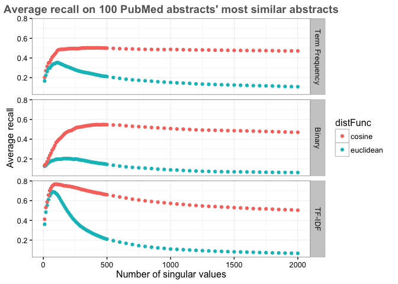

# Evaluation of SVD on PubMed data
Santina Lin  
January 6, 2016  
  

```r
library(ggplot2)
library(plyr) # mutate(), mapvalues()
library(knitr) # kable()
```

# Description of the data 

Most similar abstracts for 100 randomly chosen PubMed abstracts have been downloaded using the Bio.Entrez python package, producing about a dataset of 12240 abstracts. I used LSA on this dataset to see how well SVD can be used to retrieve back the related articles. 

# Results - Take 1 

Simply taking different combination of matrices (on frequency of terms), number of singular values, and two different similarity function, to see the recall (or precision, in this case they're the same).

First let me prepare the data 

```r
# Load data 
result <- read.table("results_avg_recall.txt")
colnames(result) <- c("matrixType", "distFunc", "nsv", "precision")
head(result)
```

```
##   matrixType distFunc  nsv precision
## 1  term_freq   cosine  100 0.4539365
## 2  term_freq   cosine 1000 0.4872131
## 3  term_freq   cosine 1050 0.4853196
## 4  term_freq   cosine 1100 0.4839336
## 5  term_freq   cosine 1150 0.4825733
## 6  term_freq   cosine 1200 0.4814873
```

```r
# Increase readability 
result$matrixType <- mapvalues(result$matrixType, from = c("tf_idf", "term_freq", "term_freq_binary"), to = c("TF-IDF", "Term Frequency", "Binary"))
head(result)
```

```
##       matrixType distFunc  nsv precision
## 1 Term Frequency   cosine  100 0.4539365
## 2 Term Frequency   cosine 1000 0.4872131
## 3 Term Frequency   cosine 1050 0.4853196
## 4 Term Frequency   cosine 1100 0.4839336
## 5 Term Frequency   cosine 1150 0.4825733
## 6 Term Frequency   cosine 1200 0.4814873
```


Now see the graph.


```r
ggplot(result, aes(x=nsv, y=precision, colour=distFunc)) + geom_point() + 
  facet_grid(matrixType ~ .) + theme_bw() + ggtitle("Average recall on 100 PubMed abstracts' most similar abstracts") +
  labs(x="Number of singular values",y="Average recall") +
  theme(plot.title = element_text(color="#666666", face="bold", size=14, hjust=0.5, vjust=1))
```

\

See where the maxima were obtained 

```r
maxima <- aggregate(precision ~ matrixType + distFunc, max, data=result)  # see maximum of all combinations 
maxima <- merge(maxima, result[, c("precision", "nsv")], by="precision") # bring in the number of nsv 
maxima <- arrange(maxima, matrixType) # arrange the dataframe
kable(maxima, format="markdown") # ensure Github can render the table
```


| precision|matrixType     |distFunc  | nsv|
|---------:|:--------------|:---------|---:|
| 0.3540866|Term Frequency |euclidean | 110|
| 0.5029798|Term Frequency |cosine    | 350|
| 0.2039233|Binary         |euclidean | 170|
| 0.5483620|Binary         |cosine    | 470|
| 0.6906519|TF-IDF         |euclidean |  70|
| 0.7672654|TF-IDF         |cosine    | 100|

In this example, precision is the same as recall because I already know how many related articles are there for each of the 100 PubMed abstracts. 

# Discussion 
