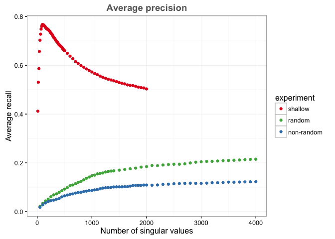
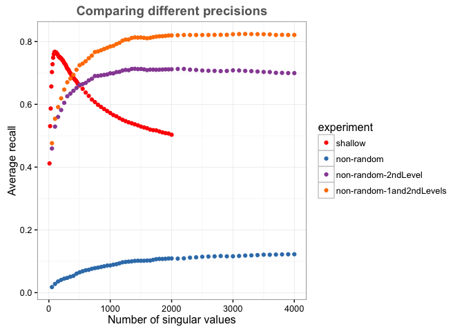

# Precisions for large SVD (shallow vs deep experiment)
Santina Lin  
March 16, 2016  

Load some library 


```r
library(ggplot2)
library(plyr) # mutate(), mapvalues()
library(knitr) # kable()
```

Load data 

```r
# With 12440 papers 
oneLevel <- read.table("../../random_100_pubmed/results/results_avg_recall.txt")
colnames(oneLevel) <- c("matrixType", "distFunc", "nsv", "precision")
oneLevel <- oneLevel[oneLevel$matrixType=="tf_idf", ]  # Select for only the matrix type we're interested in
oneLevel <- oneLevel[oneLevel$distFunc=="cosine", ]    # Select for only cosine function 
oneLevel$matrixType <- factor("tf-idf"); oneLevel$distFunc <- factor("Cosine")  # fix up the name to match the next 2
oneLevel$experiment <- factor("shallow")

# With ~2million papers, with the same starting 12440 + 2nd level closest papers 
closest_papers <- read.table("precision_results_firstLevel.txt")
colnames(closest_papers) <- c("matrixType", "distFunc", "nsv", "precision")
closest_papers$experiment <- factor("non-random")

# same number of papers (12440 papers + random papers)
random_papers <- read.table("precisions_wrandompapers.txt")
colnames(random_papers) <- c("matrixType", "distFunc", "nsv", "precision")
random_papers$experiment <- factor("random")
```

Combine the data together 


```r
all <- rbind(oneLevel,  random_papers, closest_papers)
```

Graph 


```r
ggplot(all, aes(x=nsv, y=precision)) + 
  geom_point(aes(colour=experiment)) + 
  scale_colour_manual(values=c("#e41a1c", "#4daf4a","#377eb8")) +
  theme_bw() + ggtitle("Average precision") +
  labs(x="Number of singular values",y="Average recall") +
  theme(plot.title = element_text(color="#666666", face="bold", size=14, hjust=0.5, vjust=1))
```

\


Now let's look at what happen when we take the second level IDs into account 


```r
closest_papers_2only <- read.table("precision_results_onlySecondLevel.txt")
colnames(closest_papers_2only) <- c("matrixType", "distFunc", "nsv", "precision")
closest_papers_2only$experiment <- factor("non-random-2ndLevel")

closest_papers_1and2 <- read.table("precision_results_firstANDSecondLevel.txt")
colnames(closest_papers_1and2) <- c("matrixType", "distFunc", "nsv", "precision")
closest_papers_1and2$experiment <- factor("non-random-1and2ndLevels")
```

Combine the data together 


```r
closest <- rbind(all, closest_papers_2only, closest_papers_1and2)
```

Graph 


```r
ggplot(closest[closest$experiment %in% c("shallow", "non-random", "non-random-2ndLevel", "non-random-1and2ndLevels"), ], aes(x=nsv, y=precision)) + 
  geom_point(aes(colour=experiment)) + 
  scale_colour_manual(values=c("red", "#377eb8","#984ea3", "#ff7f00")) + 
  theme_bw() + ggtitle("Comparing different precisions") +
  labs(x="Number of singular values",y="Average recall") +
  theme(plot.title = element_text(color="#666666", face="bold", size=14, hjust=0.5, vjust=1))
```

\

