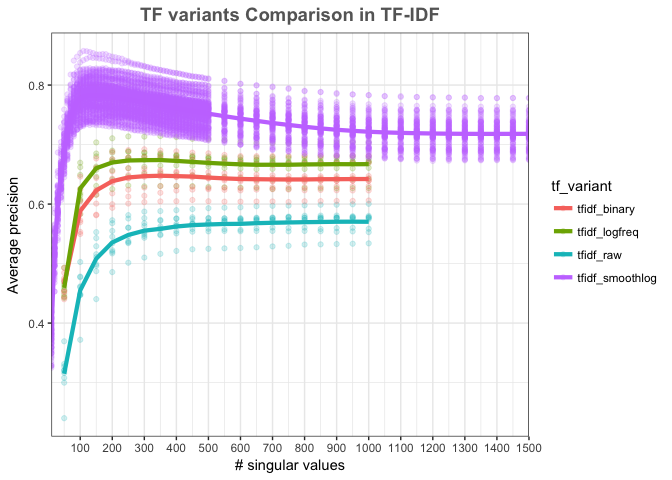
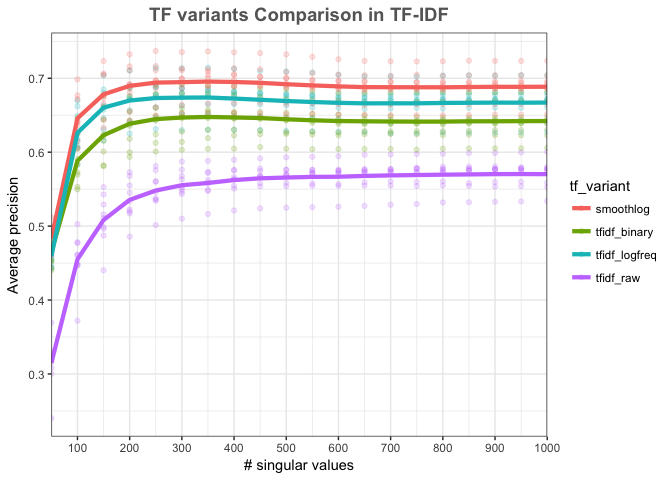

# TFIDF comparison
Santina Lin  
April 16, 2016  

There are many variant of TFIDFs (see [this wikipedia](https://en.wikipedia.org/wiki/Tf%E2%80%93idf)) Therefore I need to test a few of them. 

I decided to vary only the tf part and use 10 small samples (a subset taken from the pubmed repeat samples) to check which variant works better. 

## Note about the parameter

This is using non-squart root of singular values to scale the matrix. 
The distance metric is cosine 
tfidf_binary : tf is either 1 or 0
tfidf_logfreq : tf is log(frequency + 1) 
tfidf_raw : tf is simply the frequency 
tfidf_smoothlog: tf is 1 + log(frequency), this is the one I've been using and I'm interested to compare the other variants with this one. 

## Load the data 


```r
library(ggplot2)
library(plyr)
library(dplyr)
library(stringr)
```

Load the data I recently generated (sample starts with 1, eg 1, 11, 12, 13...)

```r
tf_variants <- read.table("../data/recall_tfcomparison.result")
str(tf_variants)
```

```
## 'data.frame':	540 obs. of  4 variables:
##  $ V1: Factor w/ 3 levels "tfidf_binary",..: 3 3 3 3 3 3 3 3 3 3 ...
##  $ V2: Factor w/ 9 levels "random_pmids_1",..: 2 2 2 2 2 2 2 2 2 2 ...
##  $ V3: int  50 100 150 200 250 300 350 400 450 500 ...
##  $ V4: num  0.331 0.46 0.511 0.534 0.546 ...
```

```r
# Preprocessing
colnames(tf_variants) <- c("tf_variant", 'sample_num', 'nsv', 'recall')
tf_variants$sample_num <- as.factor(str_replace(tf_variants$sample_num, 'random_pmids_', ''))
str(tf_variants)
```

```
## 'data.frame':	540 obs. of  4 variables:
##  $ tf_variant: Factor w/ 3 levels "tfidf_binary",..: 3 3 3 3 3 3 3 3 3 3 ...
##  $ sample_num: Factor w/ 9 levels "1","10","12",..: 2 2 2 2 2 2 2 2 2 2 ...
##  $ nsv       : int  50 100 150 200 250 300 350 400 450 500 ...
##  $ recall    : num  0.331 0.46 0.511 0.534 0.546 ...
```

Load the data from before 


```r
tf_result <- read.table("../data/tf_idf_nonsqrtsv.hugin.result")
str(tf_result)
```

```
## 'data.frame':	6440 obs. of  5 variables:
##  $ V1: int  10 10 10 10 10 10 10 10 10 10 ...
##  $ V2: Factor w/ 1 level "Cosine": 1 1 1 1 1 1 1 1 1 1 ...
##  $ V3: int  10 20 30 40 50 60 70 80 90 100 ...
##  $ V4: num  0.366 0.528 0.605 0.651 0.688 ...
##  $ V5: num  2.64 2.65 2.64 2.63 2.63 ...
```

```r
# Preproces
colnames(tf_result) <- c("sample_num", 'distFunc', 'nsv', 'recall', 'runtime')
tf_result$tf_variant <- factor('tfidf_smoothlog')
tf_result <- tf_result[, names(tf_result) %in% c('tf_variant', 'sample_num', 'nsv', 'recall')]
tf_result$sample_num <- tf_result$sample_num %>% as.factor()
tf_result <- tf_result[, c(4, 1, 2, 3)] # rearrange columns 
str(tf_result)
```

```
## 'data.frame':	6440 obs. of  4 variables:
##  $ tf_variant: Factor w/ 1 level "tfidf_smoothlog": 1 1 1 1 1 1 1 1 1 1 ...
##  $ sample_num: Factor w/ 92 levels "1","2","3","4",..: 10 10 10 10 10 10 10 10 10 10 ...
##  $ nsv       : int  10 20 30 40 50 60 70 80 90 100 ...
##  $ recall    : num  0.366 0.528 0.605 0.651 0.688 ...
```

Now combine the two and graph!! 


```r
all_variants <- rbind(tf_variants, tf_result)

create_curves <- function(data, graphTitle){
  ggplot(data, aes(x=nsv, y=recall, colour=tf_variant)) + geom_point(alpha=0.1) + 
  theme_bw() + ggtitle(graphTitle) + scale_x_continuous(expand = c(0, 0), breaks=seq(0, 1500, by=100)) + 
  labs(x="# singular values",y="Average precision") +
  theme(plot.title = element_text(color="#666666", face="bold", size=14, hjust=0.5, vjust=1))+ 
  stat_summary(fun.y = mean, geom="line", size=1.5)
}
create_curves(all_variants, "TF variants Comparison in TF-IDF")
```

\

Okay I guess it's good I went with the normal one


## Double check
Instead of using old data for the 1 + log(freq) type tf, where I had 92 samples, I'm just gonna use the same 9 samples I have for the other 3 variants. 

```r
results2 <- read.table("../data/recall_tfvariants.result2")
colnames(results2) <- c("tf_variant", 'sample_num', 'nsv', 'recall')
create_curves(results2, "TF variants Comparison in TF-IDF")
```

\

The curve looks a lot closer because smoothlog curve is lower than in the previous figure. Just double check if the result are the same. 


```r
head(tf_result)
```

```
##        tf_variant sample_num nsv    recall
## 1 tfidf_smoothlog         10  10 0.3659630
## 2 tfidf_smoothlog         10  20 0.5277346
## 3 tfidf_smoothlog         10  30 0.6053381
## 4 tfidf_smoothlog         10  40 0.6514544
## 5 tfidf_smoothlog         10  50 0.6883975
## 6 tfidf_smoothlog         10  60 0.7192338
```

```r
head(results2[results2$tf_variant=="smoothlog", ])
```

```
##     tf_variant      sample_num nsv    recall
## 541  smoothlog random_pmids_10  50 0.4832512
## 542  smoothlog random_pmids_10 100 0.6404088
## 543  smoothlog random_pmids_10 150 0.6776139
## 544  smoothlog random_pmids_10 200 0.6918593
## 545  smoothlog random_pmids_10 250 0.6966517
## 546  smoothlog random_pmids_10 300 0.6998558
```

looking at the sample 10, nsv=50, the recall doens't match.... So either because the first dataset is created from nsv=1500 for smoothlog, and the second result from nsv=1000, or that I changed the code that generated the recall value. 

## Double check: control for nsv
So I redo the SVD on the 9 samples with nsv=1500 for smoothlog. 

```r
smoothlog_1500 <- read.table("../data/recall_4tfvariants_9samples_smoothlog1500.result")
colnames(smoothlog_1500) <- c("tf_variant", 'sample_num', 'nsv', 'recall')
```

And now let's inspect this again

```r
head(tf_result[c(tf_result$nsv==50), ], 1)  # nsv=1500, old data 
```

```
##        tf_variant sample_num nsv    recall
## 5 tfidf_smoothlog         10  50 0.6883975
```

```r
head(results2[results2$tf_variant=="smoothlog", ], 1) # 1000
```

```
##     tf_variant      sample_num nsv    recall
## 541  smoothlog random_pmids_10  50 0.4832512
```

```r
head(smoothlog_1500[smoothlog_1500$tf_variant=="tfidf_smoothlog", ], 1) # nsv=1500 
```

```
##          tf_variant      sample_num nsv    recall
## 541 tfidf_smoothlog random_pmids_10  50 0.4832512
```

## Found the bug, added a line for normalizing matrix 

It looks like the code I use to calculate recall in bulk has a line for normalizing the matrix before taking the dot product, but in my find_closest.py I didn't have that line. So I fixed that and just check if the corrected new data matched the old data: 


```r
new_data <- read.table("../data/recall_fixednormalization.result")
colnames(new_data) <- c("tf_variant", 'sample_num', 'nsv', 'recall')
new_data$sample_num <- as.factor(str_replace(new_data$sample_num, 'random_pmids_', ''))
str(new_data)
```

```
## 'data.frame':	900 obs. of  4 variables:
##  $ tf_variant: Factor w/ 5 levels "tfidf_binary",..: 3 3 3 3 3 3 3 3 3 3 ...
##  $ sample_num: Factor w/ 9 levels "1","10","12",..: 2 2 2 2 2 2 2 2 2 2 ...
##  $ nsv       : int  50 100 150 200 250 300 350 400 450 500 ...
##  $ recall    : num  0.331 0.46 0.511 0.534 0.546 ...
```

```r
new_data %>% subset(nsv==50) %>% subset(sample_num=="10")
```

```
##               tf_variant sample_num nsv    recall
## 1              tfidf_raw         10  50 0.3313058
## 181        tfidf_logfreq         10  50 0.4606117
## 361         tfidf_binary         10  50 0.4721098
## 541      tfidf_smoothlog         10  50 0.4832512
## 721 tfidf_smoothlog_1000         10  50 0.4832512
```
